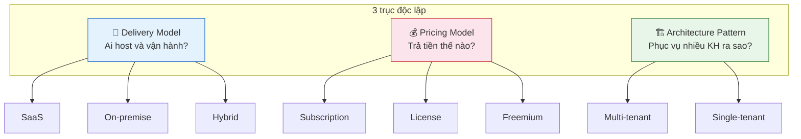

# Tổng quan SaaS

## SaaS là gì?

SaaS, viết tắt của Software as a Service, là mô hình phân phối phần mềm trong đó nhà cung cấp chịu trách nhiệm host, vận hành, bảo trì và cập nhật phần mềm. Khách hàng truy cập phần mềm qua internet, thường qua trình duyệt hoặc API, thay vì tự cài đặt và vận hành trên server riêng.

Điểm cốt lõi của SaaS là trách nhiệm vận hành nằm ở nhà cung cấp. Khách hàng dùng phần mềm như một dịch vụ.

## SaaS không đồng nghĩa với cloud

"Dùng cloud" là câu chuyện hạ tầng. SaaS là câu chuyện phân phối phần mềm.

Ví dụ:

| Trường hợp | Có phải SaaS không? | Lý do |
|---|---:|---|
| Team tự thuê EC2 để chạy backend nội bộ | Không chắc | Đây mới là dùng IaaS, chưa nói đến mô hình phân phối phần mềm |
| Google Workspace | Có | Nhà cung cấp vận hành, người dùng truy cập qua internet |
| Phần mềm kế toán cài trên server khách hàng | Thường không | Khách hàng tự vận hành hoặc vận hành tại môi trường riêng |
| Private SaaS cho một enterprise | Có thể có | Nếu nhà cung cấp vẫn quản lý vận hành và cập nhật |

SaaS có thể chạy trên public cloud, private cloud hoặc data center riêng của nhà cung cấp. Hạ tầng cụ thể không phải định nghĩa của SaaS.

## SaaS, subscription và multi-tenant là ba trục khác nhau

Một hiểu lầm dễ gặp là gom SaaS, subscription và multi-tenant thành một khái niệm. Thực tế đây là ba trục độc lập:



| Trục | Câu hỏi chính | Ví dụ |
|---|---|---|
| Delivery model | Ai host và vận hành phần mềm? | SaaS, on-premise, hybrid |
| Pricing model | Khách hàng trả tiền thế nào? | Subscription, license, freemium, pay-per-use |
| Architecture pattern | Hệ thống phục vụ nhiều khách hàng ra sao? | Multi-tenant, single-tenant |

Vì vậy:

- SaaS thường dùng subscription, nhưng subscription không đồng nghĩa với SaaS.
- SaaS thường dùng multi-tenant để tối ưu chi phí, nhưng vẫn có SaaS single-tenant.
- On-premise thường single-tenant, nhưng cũng có thể có multi-tenant nội bộ cho nhiều phòng ban.

## Vì sao SaaS phù hợp với ERP/kế toán?

Với bài toán ERP/kế toán cho nhiều doanh nghiệp, SaaS có một số lợi thế:

- Doanh nghiệp không phải tự mua server và vận hành hệ thống.
- Nhà cung cấp cập nhật tập trung khi có thay đổi về nghiệp vụ, thuế hoặc quy định.
- Một codebase có thể phục vụ nhiều doanh nghiệp nếu thiết kế multi-tenant tốt.
- Doanh nghiệp nhỏ và vừa dễ tiếp cận hơn vì chi phí ban đầu thấp.

Nhưng SaaS cũng làm backend phức tạp hơn:

- Một lỗi deploy có thể ảnh hưởng nhiều tenant.
- Dữ liệu kế toán của tenant này tuyệt đối không được lộ sang tenant khác.
- Migration database phải an toàn vì đang phục vụ nhiều khách hàng cùng lúc.
- Monitoring, logging, cache, auth và query đều phải tenant-aware.

## SaaS vs on-premise từ góc nhìn backend

| Khía cạnh | SaaS | On-premise |
|---|---|---|
| Deploy | Một bản dùng cho nhiều khách hàng | Mỗi khách hàng có thể một bản riêng |
| Sửa lỗi | Fix một lần có thể áp dụng cho tất cả | Có thể phải cập nhật từng client |
| Blast radius | Lớn nếu deploy lỗi | Nhỏ hơn theo từng client |
| Data isolation | Phải thiết kế cẩn thận | Thường tự nhiên hơn vì môi trường tách |
| Vận hành | Tập trung nhưng yêu cầu cao | Phân tán, khó đồng bộ version |
| Customization | Nên dùng config/feature flag | Có thể custom sâu hơn từng khách |

Không có lựa chọn tốt tuyệt đối. SaaS thắng ở khả năng cập nhật và vận hành tập trung, nhưng đổi lại cần kỷ luật kiến trúc và quy trình production tốt hơn.

## Feature flags

Feature flag là cơ chế bật/tắt tính năng bằng cấu hình thay vì phải deploy riêng cho từng nhóm khách hàng.

Trong SaaS đa tenant, feature flag giúp:

- Bật tính năng mới cho một số tenant trước.
- Tắt nhanh tính năng lỗi mà không rollback toàn bộ hệ thống.
- Hỗ trợ rollout theo gói dịch vụ hoặc nhóm khách hàng.
- Giảm blast radius khi tính năng chưa ổn định.

Mô hình dữ liệu đơn giản:

```text
feature_flags
- id
- code
- default_enabled

tenant_feature_flags
- tenant_id
- feature_flag_id
- enabled
```

Khi xử lý request, service đọc tenant hiện tại, kiểm tra flag tương ứng, cache kết quả theo tenant và quyết định có cho dùng tính năng hay không.

## Zero-downtime deployment

Trong SaaS, deployment không thể giả định rằng hệ thống được dừng để cập nhật. Các tenant có thể đang dùng hệ thống liên tục.

Một chiến lược zero-downtime cơ bản cần:

- Rolling deployment: thay dần từng instance.
- Blue-green deployment: dựng môi trường mới song song rồi chuyển traffic.
- Health check: chỉ nhận traffic khi instance mới khỏe.
- Feature flags: deploy code trước, bật tính năng sau.
- Backward-compatible migration: schema mới vẫn tương thích với code cũ trong lúc rollout.

Ví dụ migration an toàn hơn:

```sql
ALTER TABLE invoice ADD COLUMN tax_code varchar(20);
```

Sau đó deploy code biết dùng cột mới, backfill dữ liệu nếu cần, rồi mới thêm constraint chặt hơn ở bước sau.

Ví dụ migration rủi ro hơn:

```sql
ALTER TABLE invoice ALTER COLUMN amount TYPE numeric(20,2);
```

Lệnh đổi kiểu có thể rewrite bảng lớn và giữ lock lâu. Với SaaS, lock lâu trên bảng dùng chung có thể ảnh hưởng nhiều tenant.

## Điều cần nhớ

1. SaaS là delivery model.
2. Multi-tenant là architecture pattern.
3. Subscription là pricing model.
4. Ba khái niệm này thường đi cùng nhưng không đồng nghĩa.
5. SaaS giúp vận hành tập trung, nhưng làm tăng yêu cầu về isolation, migration, rollout và observability.
