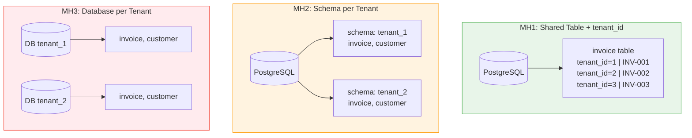
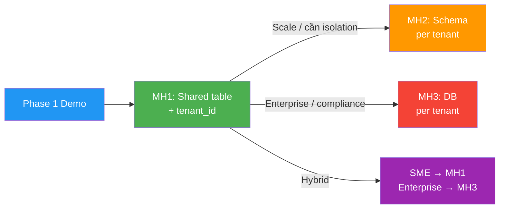

# Các mô hình Tenant Isolation

Tenant isolation là cách hệ thống tách dữ liệu và tài nguyên giữa các tenant. Ba mô hình phổ biến là shared table với `tenant_id`, schema per tenant và database per tenant.

## Sơ đồ tổng quan 3 mô hình



## Mô hình 1: Shared database, shared table, có tenant_id

Tất cả tenant dùng chung database và chung bảng. Mỗi bảng nghiệp vụ có cột `tenant_id`.

```sql
CREATE TABLE invoice (
    id bigserial PRIMARY KEY,
    tenant_id bigint NOT NULL,
    invoice_no varchar(50) NOT NULL,
    status varchar(20) NOT NULL,
    amount numeric(18,2) NOT NULL,
    created_at timestamp NOT NULL DEFAULT now()
);
```

Mọi query nghiệp vụ phải filter theo tenant:

```sql
SELECT *
FROM invoice
WHERE tenant_id = :tenant_id
  AND status = 'PAID';
```

Ưu điểm:

- Chi phí thấp nhất.
- Dễ bắt đầu, phù hợp giai đoạn học và demo.
- Migration chỉ chạy một lần trên một schema chung.
- Dễ query cross-tenant cho platform admin nếu được kiểm soát.

Nhược điểm:

- Rủi ro data leakage cao nếu quên filter `tenant_id`.
- Isolation chủ yếu nằm ở application layer.
- Tenant lớn có thể gây noisy neighbor.
- Backup/restore riêng từng tenant khó hơn.
- Custom schema theo tenant gần như không phù hợp.

Phù hợp khi:

- Số tenant lớn.
- Dữ liệu mỗi tenant nhỏ đến trung bình.
- Cần tốc độ phát triển nhanh.
- Đang ở giai đoạn demo, MVP hoặc chuẩn bị nền tảng.

## Mô hình 2: Schema per tenant

Các tenant dùng chung database engine, nhưng mỗi tenant có một schema riêng.

```text
postgres_db
├── tenant_a.invoice
├── tenant_a.customer
├── tenant_b.invoice
└── tenant_b.customer
```

Ưu điểm:

- Isolation tốt hơn shared table.
- Có namespace riêng trong database.
- Backup/restore theo tenant dễ hơn shared table.
- Có thể custom schema cho một số tenant nếu thật sự cần.

Nhược điểm:

- Migration phải chạy qua nhiều schema.
- Dễ gặp partial migration: một số schema thành công, một số schema fail.
- Tooling, connection, search path và vận hành phức tạp hơn.
- Khi số tenant rất lớn, quản lý schema trở nên nặng.

Phù hợp khi:

- Số tenant vừa phải.
- Cần isolation cao hơn shared table nhưng chưa cần database riêng.
- Team có năng lực vận hành migration nhiều schema.

## Mô hình 3: Database per tenant

Mỗi tenant có một database riêng.

```text
tenant_a_db
tenant_b_db
tenant_c_db
```

Ưu điểm:

- Isolation mạnh nhất.
- Backup/restore theo tenant rõ ràng.
- Dễ đáp ứng yêu cầu enterprise hoặc compliance.
- Tenant lớn ít ảnh hưởng trực tiếp đến tenant khác ở tầng database.

Nhược điểm:

- Chi phí cao.
- Vận hành nhiều database phức tạp.
- Migration phải chạy N lần.
- Connection pool, monitoring và backup phải quản lý theo nhiều database.
- Cross-tenant query khó hơn.

Phù hợp khi:

- Tenant enterprise có dữ liệu nhạy cảm.
- Tenant có SLA riêng hoặc yêu cầu lưu trữ riêng.
- Số tenant ít hoặc có khả năng trả chi phí vận hành cao hơn.

## So sánh nhanh

| Tiêu chí | Shared table + tenant_id | Schema per tenant | Database per tenant |
|---|---:|---:|---:|
| Chi phí | Thấp | Trung bình | Cao |
| Data isolation | Thấp đến trung bình | Trung bình | Cao |
| Migration | Đơn giản nhất | Phức tạp | Phức tạp nhưng độc lập hơn |
| Noisy neighbor | Dễ xảy ra | Giảm một phần | Giảm mạnh hơn |
| Backup/restore tenant | Khó | Trung bình | Dễ |
| Customization | Kém | Có thể | Có thể |
| Phù hợp Phase 1 | Rất phù hợp | Chưa cần | Quá sớm |

## Hướng chọn cho Phase 1

Với Phase 1, lựa chọn hợp lý là shared table với `tenant_id` vì:

- Đủ để học đúng bản chất multi-tenant.
- Dễ quan sát rủi ro data leakage, index tenant-aware và cache tenant-aware.
- Không làm phức tạp quá sớm bằng nhiều schema hoặc nhiều database.
- Có thể tiến hóa sau nếu dữ liệu, tenant enterprise hoặc yêu cầu compliance tăng.


