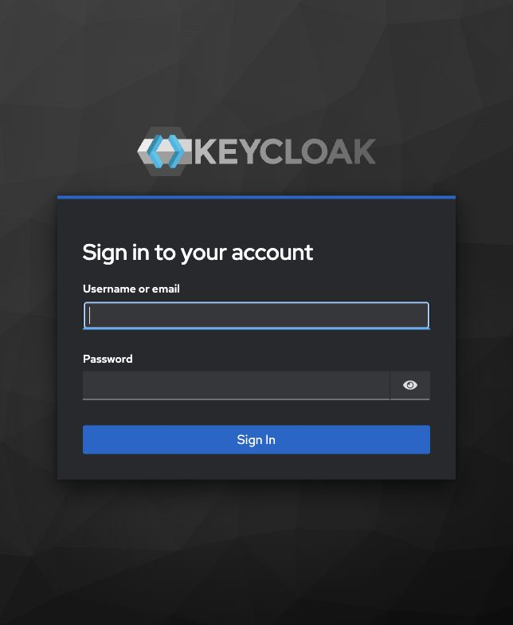
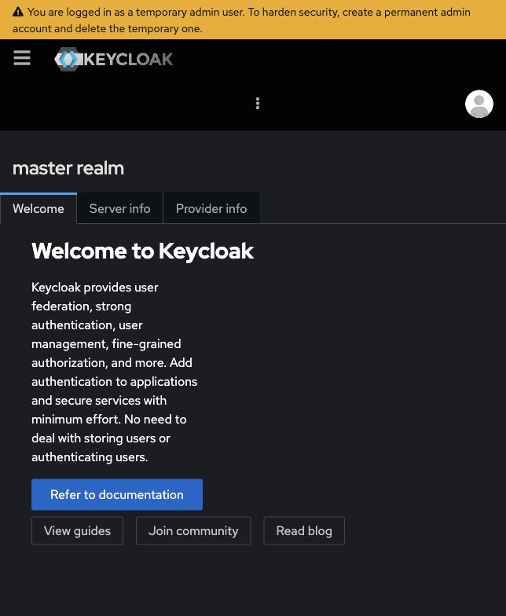
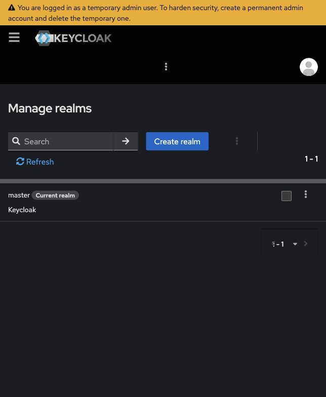
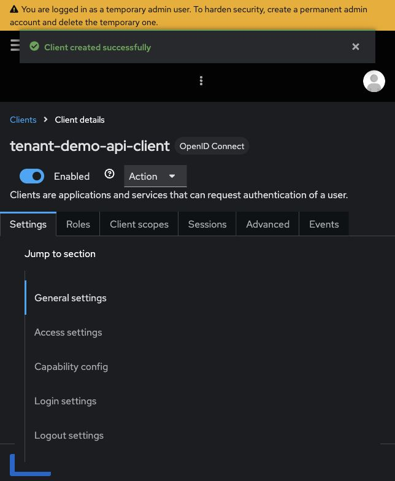
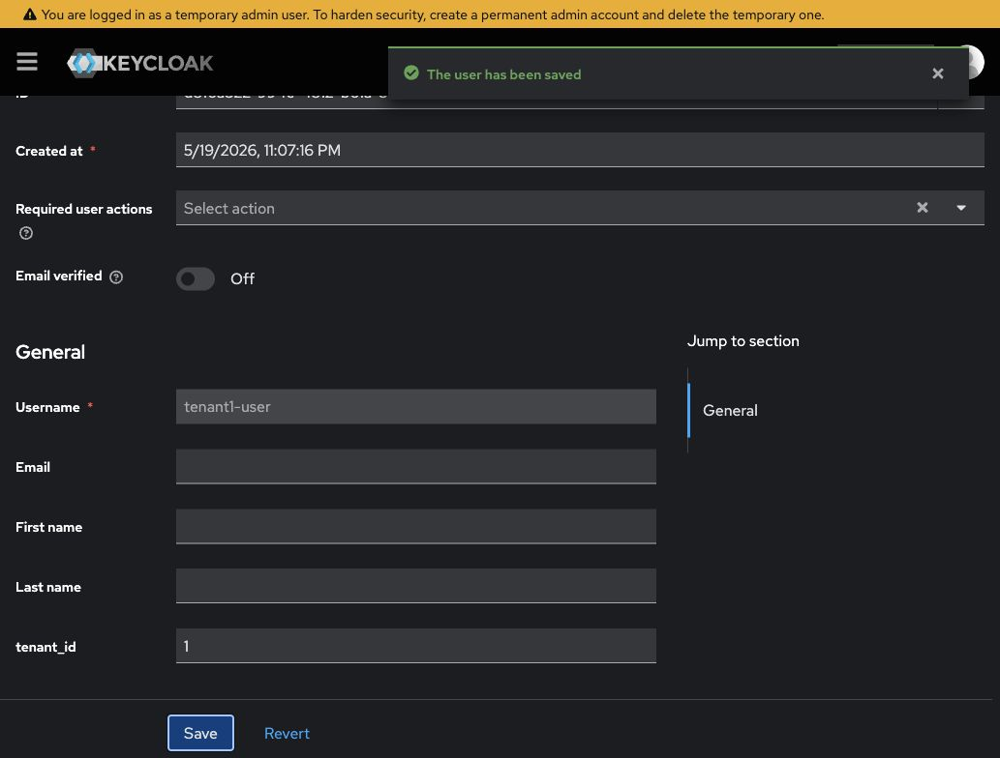
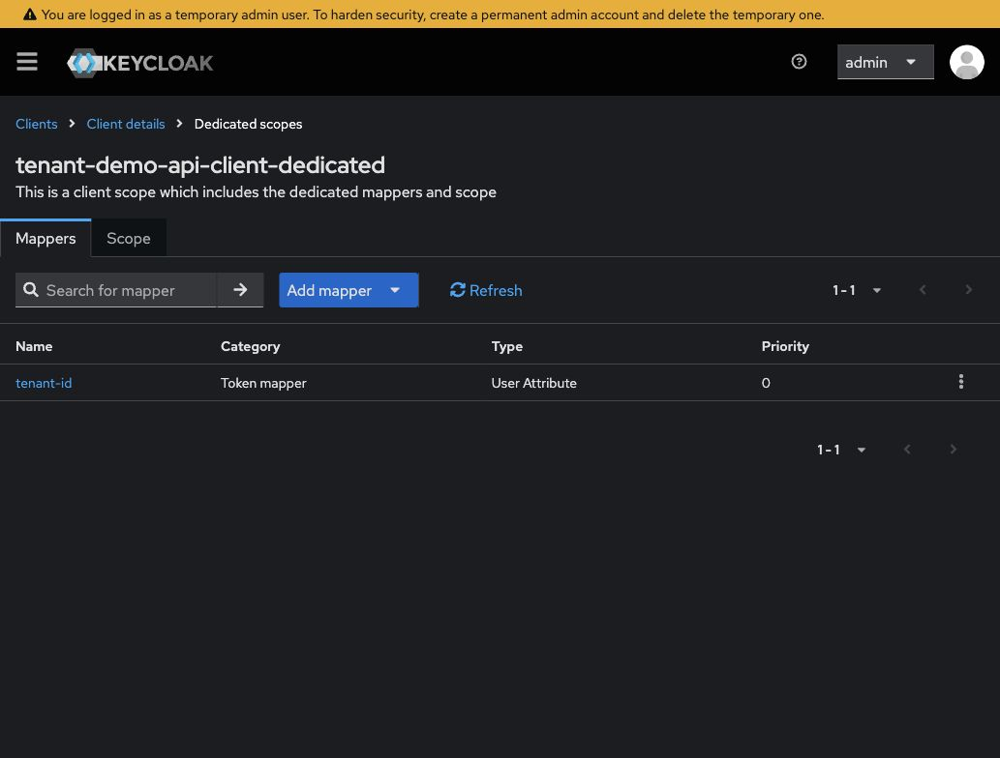
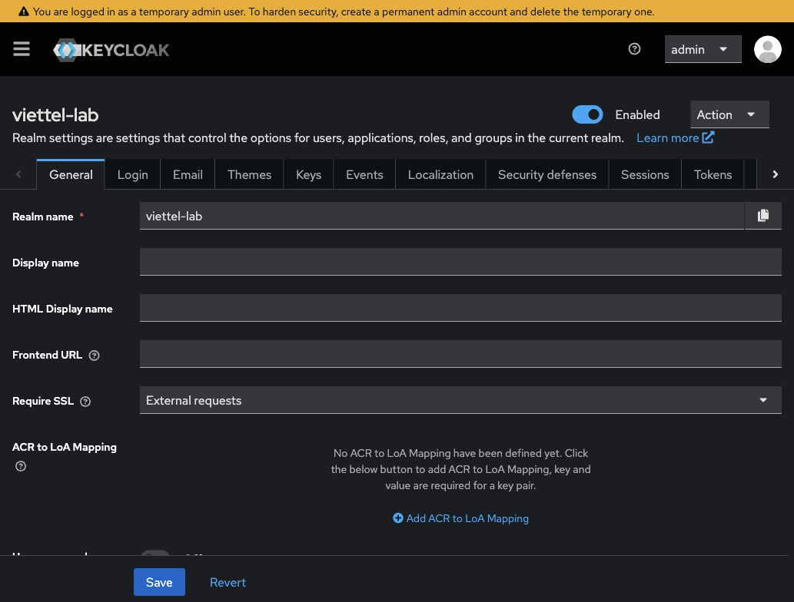

# Keycloak Admin Console - hướng dẫn trực quan cho mini-lab

## Mục tiêu

Tài liệu này giúp mình bớt bỡ ngỡ khi lần đầu mở Keycloak Admin Console. Mục tiêu hiện tại chỉ là dùng được Keycloak ở mức mini-lab:

- tạo realm riêng cho lab;
- tạo client để lấy access token;
- tạo user thuộc tenant 1 và tenant 2;
- đưa claim `tenant_id` vào access token;
- hiểu Spring Boot Resource Server sẽ validate token bằng `issuer`/`JWKS`;
- giữ nguyên nguyên tắc tenant-aware ở service/repository.

Không mục tiêu lúc này:

- không học toàn bộ IAM/RBAC production;
- không thiết kế role matrix đầy đủ;
- không làm login UI/React;
- không thay thế ngay flow JWT tạm nếu chưa profile-gated an toàn.

## Bản đồ tư duy nhanh

File này tập trung vào việc bấm UI trong Admin Console. Nếu cần hiểu kỹ flow JWT tạm vs Keycloak/OIDC, đọc file trung tâm:

- `docs/05-security/keycloak-oidc-mental-model.md`

Tóm tắt ngắn:

```text
Keycloak phát token
-> Spring Boot Resource Server validate bằng issuer/JWKS
-> tenant_id claim đã validate được đưa vào TenantContext
```

Điểm quan trọng: Keycloak giúp backend tin được danh tính/token, nhưng **không thay thế** việc query theo `tenantId`.

## Screenshot checklist

Các ảnh dưới đây được chụp từ Keycloak local dev tại `http://localhost:18080` với dữ liệu mini-lab `viettel-lab`. Không có access token thật hoặc secret production trong ảnh.



*Màn hình đăng nhập Admin Console. Lab dùng tài khoản dev-only `admin/admin` từ `docker-compose.yml`.*



*Sau khi đăng nhập, menu bên trái là nơi đi tới Clients, Users, Realm settings, Events, Sessions và các phần cấu hình khác.*



*Trang quản lý realm. Mini-lab tạo realm riêng `viettel-lab` để không cấu hình trực tiếp trên realm `master`.*



*Client `tenant-demo-api-client` là client local để xin token trong mini-lab. Direct Access Grants chỉ dùng để học local nhanh.*



*User `tenant1-user` có attribute `tenant_id = 1`. Claim này chỉ đáng tin sau khi token đã được Keycloak ký và backend validate.*



*Mapper `tenant-id` đưa user attribute `tenant_id` vào token claim `tenant_id`, để backend có thể set `TenantContext` sau khi token hợp lệ.*



*Realm settings có phần Endpoints. `OpenID Endpoint Configuration` dẫn tới metadata OIDC, nơi có `issuer`, `token_endpoint`, `jwks_uri`.*

## Cần dùng ngay trong giai đoạn hiện tại

| Màn hình / khái niệm | Mình dùng để làm gì trong mini-lab |
|---|---|
| Realm | Tạo không gian lab riêng: `viettel-lab`. |
| Clients | Tạo client `tenant-demo-api-client` để xin token. |
| Users | Tạo `tenant1-user`, `tenant2-user`. |
| Credentials | Đặt password local cho user lab. |
| User attributes | Gắn `tenant_id = 1` hoặc `tenant_id = 2` cho user. |
| Client scopes / Mappers | Đưa user attribute `tenant_id` vào access token. |
| Realm settings | Xác định issuer và metadata endpoint. |
| `.well-known/openid-configuration` | Xem `issuer`, `jwks_uri`, endpoints OIDC. |
| JWKS | Public keys để backend verify chữ ký token từ Keycloak. |

## Biết qua để đỡ bỡ ngỡ

| Màn hình / khái niệm | Ý nghĩa ngắn |
|---|---|
| Roles | Quyền người dùng. Phase này chỉ cần role đơn giản nếu muốn quan sát, chưa làm ma trận RBAC. |
| Groups | Nhóm user để gán role/thuộc tính hàng loạt. Chưa cần dùng ngay. |
| Sessions | Theo dõi phiên đăng nhập/token session. Hữu ích khi debug login/logout sau này. |
| Events | Log sự kiện đăng nhập, lỗi đăng nhập, admin actions. Hữu ích khi debug. |
| Identity Providers | Kết nối Google/Microsoft/LDAP/OIDC khác. Chưa cần trong lab này. |
| Authentication | Flow đăng nhập/MFA/password policy. Chưa cần chỉnh sâu. |
| User federation | Kết nối LDAP/AD. Ngoài scope Phase 1 mini-lab. |

## Chưa cần đào sâu lúc này

- Fine-grained authorization policies.
- Multi-factor authentication.
- Key rotation/JWK rotation production.
- Keycloak cluster, external database, HTTPS, backup/restore.
- Full role hierarchy cho ERP/accounting.
- Frontend Authorization Code + PKCE flow.

## Các màn hình chính trong Admin Console

### Realm

Realm là một “không gian quản lý” riêng. User, client, role trong realm này tách khỏi realm khác.

Trong lab:

```text
Realm name: viettel-lab
Issuer: http://localhost:18080/realms/viettel-lab
```

Đường dẫn thường dùng:

```text
Realm selector -> Create realm
```

Kỳ vọng sau khi tạo:

- góc trái/top của Admin Console đang chọn realm `viettel-lab`;
- metadata endpoint mở được:

```text
http://localhost:18080/realms/viettel-lab/.well-known/openid-configuration
```

### Clients

Client là ứng dụng xin token hoặc tham gia OIDC flow. Trong mini-lab, HTTP Client/curl đóng vai client học tập để xin access token.

Đường dẫn thường dùng:

```text
Clients -> Create client
```

Gợi ý cấu hình local:

| Field | Giá trị lab |
|---|---|
| Client type | `OpenID Connect` |
| Client ID | `tenant-demo-api-client` |
| Client authentication | `Off` nếu dùng public client cho lab |
| Direct access grants | `On` để xin token nhanh bằng username/password trong HTTP Client |

Lưu ý: Direct Access Grant/password grant chỉ dùng để học local nhanh. Với frontend production, hướng phổ biến hơn là Authorization Code + PKCE.

### Users

User là tài khoản đăng nhập trong realm.

Đường dẫn thường dùng:

```text
Users -> Add user / Create new user
```

Tạo tối thiểu:

```text
tenant1-user
tenant2-user
```

Sau đó vào tab/section `Credentials` để đặt password:

```text
password
Temporary: Off
```

Password này chỉ là password user lab. Nó **không phải** secret dùng để ký JWT.

### User attributes và tenant_id

Để backend biết user thuộc tenant nào, lab dùng user attribute:

```text
tenant1-user: tenant_id = 1
tenant2-user: tenant_id = 2
```

Đường dẫn thường gặp:

```text
Users -> chọn user -> Attributes -> Add attribute
```

Nếu UI Keycloak version mới đổi vị trí tab, hãy tìm trong trang chi tiết user phần `Attributes` hoặc `User profile`. Không cần chỉnh sâu user profile policy trong mini-lab nếu Admin Console vẫn cho thêm attribute thủ công.

Ghi chú thực tế với Keycloak 26.x: custom user attribute có thể bị User Profile policy quản lý chặt hơn. Nếu dùng CLI/API mà `tenant_id` không được lưu, kiểm tra `Realm settings -> User profile` hoặc dùng Admin REST để update user representation đầy đủ. Dấu hiệu verify cuối cùng vẫn là access token có claim `tenant_id`.

### Client scopes / Mappers

User attribute tự nó chưa chắc xuất hiện trong access token. Cần protocol mapper để biến `tenant_id` thành claim.

Đường dẫn thường gặp trong Keycloak bản mới:

```text
Clients
-> tenant-demo-api-client
-> Client scopes
-> mở dedicated scope của client
-> Mappers
-> Configure a new mapper
-> User Attribute
```

Cấu hình mapper gợi ý:

| Field | Giá trị lab |
|---|---|
| Name | `tenant-id` |
| User Attribute | `tenant_id` |
| Token Claim Name | `tenant_id` |
| Claim JSON Type | `long` hoặc `String` |
| Add to access token | `On` |

Kỳ vọng: access token sau khi decode có claim `tenant_id`.

### Realm settings, issuer và JWKS

Spring Boot Resource Server không cần gọi database Keycloak để validate từng request. Nó dùng metadata và public key.

Các URL quan trọng:

```text
Issuer:
http://localhost:18080/realms/viettel-lab

OIDC metadata:
http://localhost:18080/realms/viettel-lab/.well-known/openid-configuration

JWKS:
đọc từ field jwks_uri trong metadata
```

Backend sau này sẽ chuyển từ JWT tạm local sang hướng cấu hình kiểu:

```yaml
spring:
  security:
    oauth2:
      resourceserver:
        jwt:
          issuer-uri: http://localhost:18080/realms/viettel-lab
```

## So sánh JWT tạm và Keycloak/OIDC

| Câu hỏi | JWT tạm hiện tại | Keycloak/OIDC mini-lab |
|---|---|---|
| Ai phát hành token? | Spring Boot dev endpoint | Keycloak |
| Backend verify bằng gì? | HS256 local secret | issuer/JWKS từ Keycloak |
| User nằm ở đâu? | Chưa có user thật | Keycloak realm |
| `tenant_id` đến từ đâu? | Dev token service | User attribute + protocol mapper |
| Có production-ready chưa? | Không | Gần kiến trúc thật hơn, nhưng mini-lab vẫn chưa production |

## Mini-lab từng bước

### Bước 1: chạy Keycloak

```bash
cd lab-code/keycloak-lab
docker compose up -d
```

Mở:

```text
http://localhost:18080
```

Đăng nhập dev-only:

```text
admin / admin
```

Kết quả mong đợi: vào được Admin Console.

### Bước 2: tạo realm

Click:

```text
Realm selector -> Create realm
```

Nhập:

```text
viettel-lab
```

Vì sao quan trọng: realm giúp lab không lẫn với realm `master`.

Kết quả mong đợi: realm selector đang ở `viettel-lab`.

### Bước 3: tạo client

Click:

```text
Clients -> Create client
```

Nhập tối thiểu:

```text
Client type: OpenID Connect
Client ID: tenant-demo-api-client
```

Ở phần capability/config:

```text
Client authentication: Off
Direct access grants: On
```

Vì sao quan trọng: client này đại diện cho tool đang xin token trong mini-lab.

Kết quả mong đợi: client xuất hiện trong danh sách `Clients`.

### Bước 4: tạo user và password

Click:

```text
Users -> Create new user
```

Tạo:

```text
tenant1-user
tenant2-user
```

Sau đó:

```text
Users -> chọn user -> Credentials -> Set password
Temporary: Off
```

Vì sao quan trọng: user là subject (`sub`) trong token.

Kết quả mong đợi: mỗi user có thể xin token bằng password local.

### Bước 5: gắn tenant_id cho user

Click:

```text
Users -> chọn user -> Attributes
```

Thêm:

```text
tenant1-user: tenant_id = 1
tenant2-user: tenant_id = 2
```

Vì sao quan trọng: backend cần biết request thuộc tenant nào, nhưng chỉ tin claim sau khi token đã được Keycloak ký và Spring Security validate.

Kết quả mong đợi: attribute được lưu trong user.

### Bước 6: tạo mapper để đưa tenant_id vào access token

Click:

```text
Clients
-> tenant-demo-api-client
-> Client scopes
-> dedicated scope của client
-> Mappers
-> Configure a new mapper
-> User Attribute
```

Cấu hình:

```text
User Attribute: tenant_id
Token Claim Name: tenant_id
Add to access token: On
```

Vì sao quan trọng: nếu thiếu mapper, user có attribute nhưng access token không có claim `tenant_id`.

Kết quả mong đợi: token decode ra có `tenant_id`.

### Bước 7: lấy token

Dùng:

```text
lab-code/keycloak-lab/http/keycloak-token-flow.http
```

Hoặc curl:

```bash
curl -s \
  -X POST "http://localhost:18080/realms/viettel-lab/protocol/openid-connect/token" \
  -H "Content-Type: application/x-www-form-urlencoded" \
  -d "grant_type=password" \
  -d "client_id=tenant-demo-api-client" \
  -d "username=tenant1-user" \
  -d "password=password"
```

Vì sao quan trọng: đây là access token thật do Keycloak phát hành, khác với dev token endpoint trong Spring Boot.

Kết quả mong đợi: response JSON có `access_token`. Không commit token thật vào repo.

### Bước 8: kiểm tra metadata và token claims

Mở metadata:

```text
http://localhost:18080/realms/viettel-lab/.well-known/openid-configuration
```

Cần nhận ra:

- `issuer`;
- `jwks_uri`;
- `token_endpoint`.

Decode access token bằng công cụ local/IntelliJ/jwt.io chỉ để học claim. Cần thấy:

- `iss = http://localhost:18080/realms/viettel-lab`;
- `sub` tồn tại;
- `exp` tồn tại;
- `tenant_id = 1` hoặc `tenant_id = 2`.

### Bước 9: liên hệ với Spring Boot

Hiện tại `tenant-demo` vẫn dùng JWT tạm local để giữ app/test ổn định. Khi sang mode Keycloak, hướng đúng là:

```text
Keycloak token
-> Spring Security Resource Server validate bằng issuer/JWKS
-> JwtTenantContextFilter đọc tenant_id claim
-> TenantContext
-> MasterDataService
-> MasterDataRepository query tenant-aware
```

Done ở giai đoạn này không phải là “tích hợp full Keycloak vào code”, mà là hiểu và chứng minh được token flow.

## Checklist tự kiểm tra

- [ ] Tôi biết realm `viettel-lab` là gì.
- [ ] Tôi biết client `tenant-demo-api-client` dùng để xin token.
- [ ] Tôi tạo được user tenant 1 và tenant 2.
- [ ] Tôi biết password user khác với JWT signing key/Keycloak key.
- [ ] Tôi đưa được `tenant_id` vào access token.
- [ ] Tôi mở được OIDC metadata và chỉ ra `issuer`, `jwks_uri`.
- [ ] Tôi hiểu backend chỉ đọc `tenant_id` sau khi token validate.
- [ ] Tôi hiểu Keycloak không thay thế tenant-aware repository query.

## Khi bị kẹt thì kiểm tra gì?

| Triệu chứng | Nên kiểm tra |
|---|---|
| Không vào được Admin Console | Container có chạy không, port `18080` có đúng không. |
| Token endpoint báo invalid client | Client ID đúng chưa, client có Direct Access Grants chưa. |
| Token endpoint báo invalid user/password | User enabled chưa, password đã set và Temporary Off chưa. |
| Token không có `tenant_id` | User attribute đã lưu chưa, mapper có `Add to access token` chưa. |
| Spring Boot sau này reject token | `issuer-uri` có khớp `iss` trong token không, Keycloak có chạy không. |

## Đọc liên quan

- `docs/05-security/keycloak-oidc-mental-model.md`
- `docs/05-security/keycloak-oauth2-oidc-awareness.md`
- `docs/05-security/keycloak-mini-lab-plan.md`
- `lab-code/keycloak-lab/README.md`
- `docs/05-security/oauth2-jwt-resource-server-concepts.md`
- `docs/05-security/jwt-implementation-walkthrough.md`

## Nguồn tham khảo chuẩn

- [Keycloak - Getting started with Docker](https://www.keycloak.org/getting-started/getting-started-docker)
- [Keycloak - Server Administration Guide](https://www.keycloak.org/docs/latest/server_admin/)
- [Spring Security - OAuth2 Resource Server JWT](https://docs.spring.io/spring-security/reference/servlet/oauth2/resource-server/jwt.html)
- [Spring Boot - OAuth2 Resource Server](https://docs.spring.io/spring-boot/reference/web/spring-security.html#web.security.oauth2.resource-server)
- [OpenID Connect Core 1.0](https://openid.net/specs/openid-connect-core-1_0-18.html)
- [RFC 6750 - Bearer Token Usage](https://www.rfc-editor.org/rfc/rfc6750)
