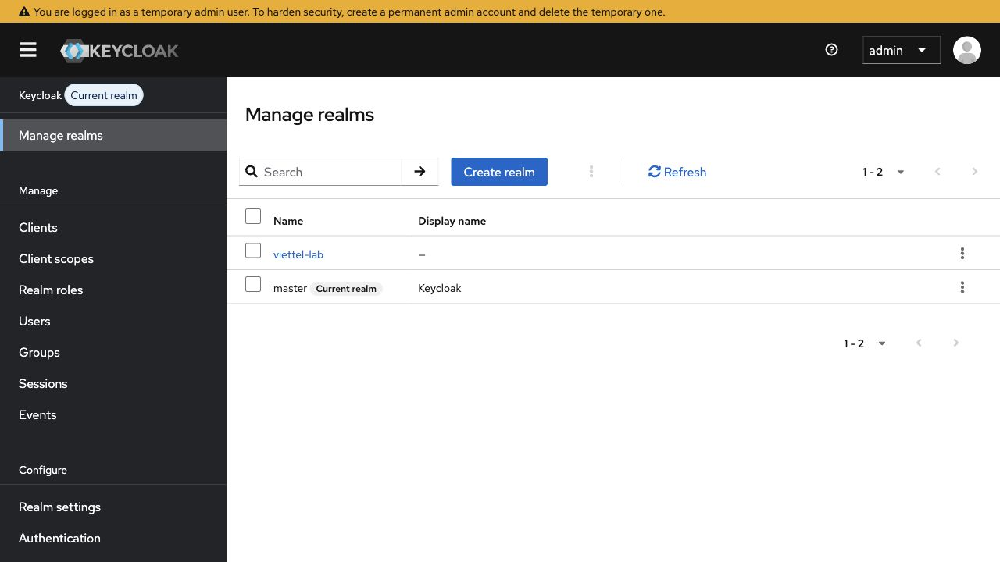
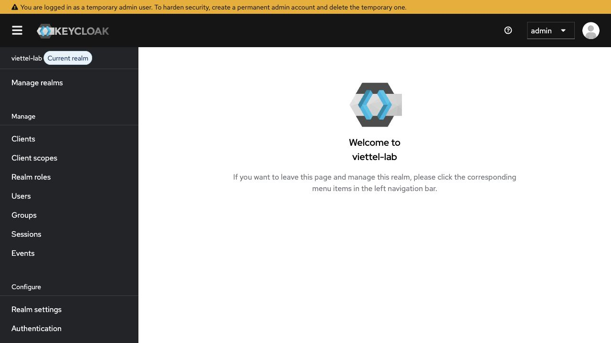
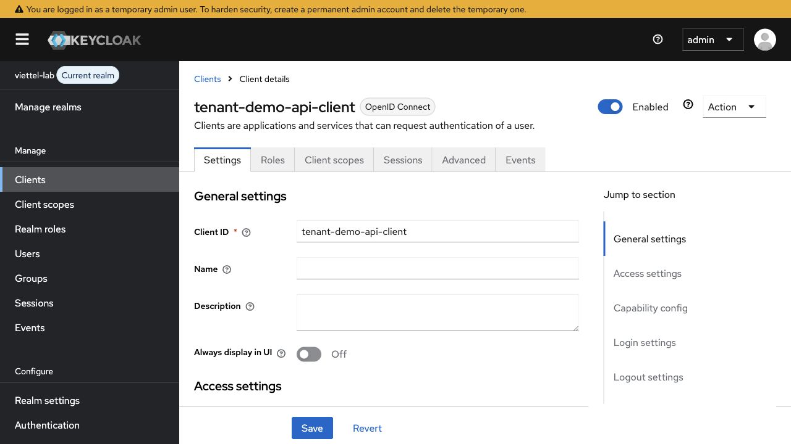
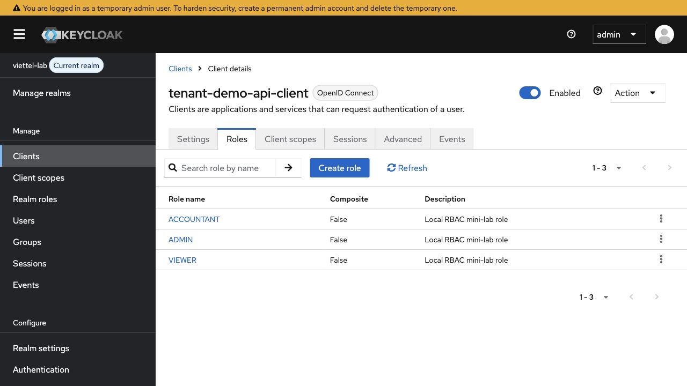
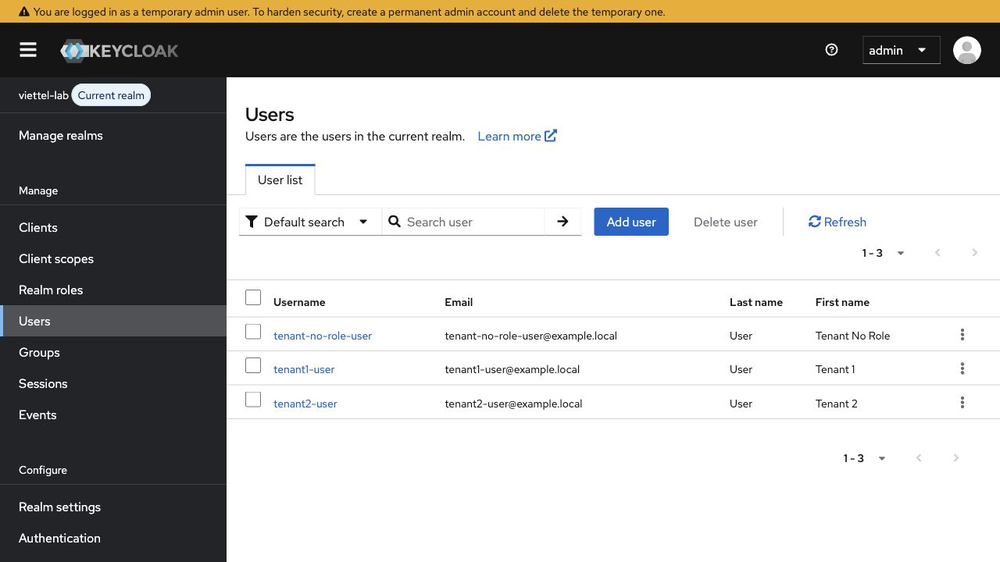
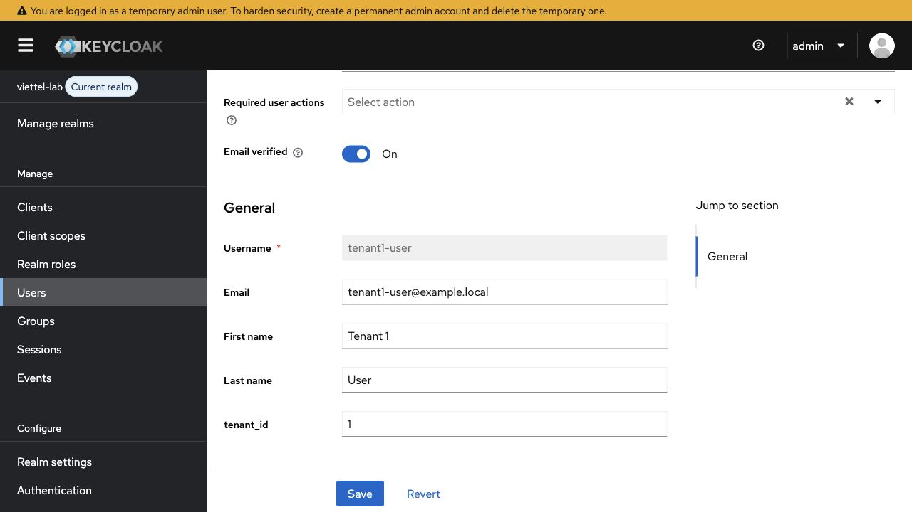
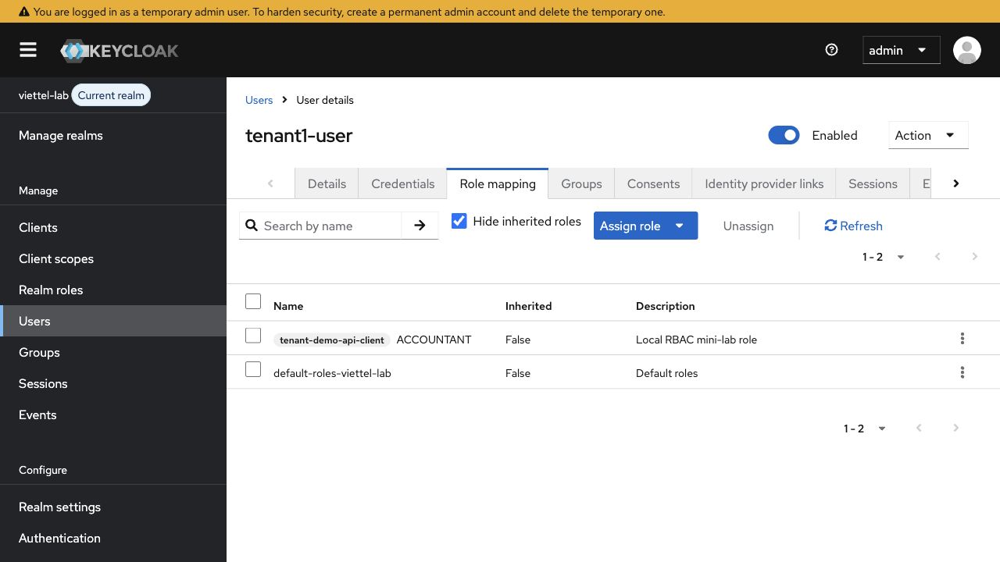

# Keycloak Authorization Admin Console guide

## Vai trò tài liệu

Guide này giúp thao tác RBAC cơ bản trong Keycloak Admin Console cho mini-lab. Đây là phần thao tác UI, không thay thế theory:

- Nền tảng RBAC: `keycloak-authorization-rbac-tenant-scope.md`
- Code guide Spring Boot: `keycloak-authorization-code-guide-spring-boot.md`

Mục tiêu hiện tại: tạo vài role đơn giản, gán role cho user, lấy token và kiểm tra role claim xuất hiện. Không cần học Keycloak Authorization Services/UMA hoặc role matrix production trong bước này.

Ảnh trong tài liệu được chụp từ Keycloak local dev `http://localhost:18080`, realm `viettel-lab`. Không commit access token thật, admin token hoặc secret production.

---

## 1. Chọn realm `viettel-lab`

Mở Admin Console:

```text
http://localhost:18080
```

Login bằng tài khoản dev local đã ghi trong `lab-code/keycloak-lab/docker-compose.yml`:

```text
admin / admin
```

Vào `Manage realms` và chọn `viettel-lab`.



Kết quả mong đợi:

- Có realm `viettel-lab`.
- Không cấu hình RBAC lab trực tiếp trên realm `master`.

Sau khi chọn realm, góc trái sẽ hiển thị `viettel-lab` là current realm.



Lỗi hay gặp: tạo role/user ở nhầm realm `master`, sau đó token lấy từ `viettel-lab` không thấy role.

---

## 2. Mở client `tenant-demo-api-client`

Vào:

```text
Clients
-> tenant-demo-api-client
```



Kết quả mong đợi:

- Client tồn tại trong realm `viettel-lab`.
- Client đại diện cho backend/API local trong mini-lab.
- RBAC mini-lab sẽ ưu tiên dùng client roles của client này.

Vì sao dùng client roles trong bước này?

- Role gắn với `tenant-demo-api-client` sát với backend API hơn realm role chung.
- Token sẽ có role ở `resource_access.tenant-demo-api-client.roles`.
- Spring Boot có thể map các role này thành `GrantedAuthority`.

---

## 3. Tạo client roles

Trong client `tenant-demo-api-client`, mở tab:

```text
Roles
```

Tạo các role:

```text
ADMIN
ACCOUNTANT
VIEWER
```



Kết quả mong đợi:

- `ADMIN`, `ACCOUNTANT`, `VIEWER` xuất hiện trong client roles.
- Description có thể ghi ngắn như `Local RBAC mini-lab role`.

Common mistake:

- Tạo role ở `Realm roles` nhưng code lại đọc `resource_access.<client>.roles`.
- Tạo client role đúng nhưng lấy token cũ trước khi assign role.

Ghi nhớ nhanh:

```text
Client roles -> resource_access.tenant-demo-api-client.roles
Realm roles  -> realm_access.roles
```

Trong mini-lab này, ưu tiên client roles để luyện đúng hướng backend resource server.

---

## 4. Kiểm tra users dùng cho RBAC lab

Vào:

```text
Users
```

Mini-lab hiện có các user:

- `tenant1-user`
- `tenant2-user`
- `tenant-no-role-user` nếu cần case `403`



Kết quả mong đợi:

- User thuộc cùng realm `viettel-lab`.
- User có email/tên rõ ràng để sau này nhìn lại không nhầm.
- User dùng để test quyền không được lẫn với user dùng để test tenant.

Gợi ý test:

| User | tenant_id | Role gợi ý | Mục đích |
|---|---:|---|---|
| `tenant1-user` | `1` | `ACCOUNTANT` | Case allowed tenant 1. |
| `tenant2-user` | `2` | `VIEWER` | Case allowed tenant 2 hoặc read-only. |
| `tenant-no-role-user` | `1` | không gán role | Case `403`. |

---

## 5. Kiểm tra `tenant_id` attribute

Mở:

```text
Users
-> tenant1-user
-> Details
```

Keycloak 26.x có thể hiển thị custom attribute ngay trong form user profile nếu realm User Profile đã cho phép attribute đó.



Kết quả mong đợi:

- `tenant1-user` có `tenant_id = 1`.
- `tenant2-user` có `tenant_id = 2`.
- Token sau khi decode phải có claim `tenant_id`.

Ghi chú Keycloak 26.x:

- Nếu `tenant_id` không lưu được, kiểm tra `Realm settings -> User profile`.
- Một số cấu hình User Profile có thể yêu cầu field như email, first name, last name hoặc email verified.
- Khi setup bằng Admin REST/CLI, update user đôi khi cần gửi representation đủ field hơn là chỉ gửi riêng `attributes`.
- Verify cuối cùng luôn là access token có claim `tenant_id`, không chỉ nhìn UI.

---

## 6. Gán role cho user

Mở user cần test:

```text
Users
-> tenant1-user
-> Role mapping
-> Assign role
```

Gán client role, ví dụ:

```text
tenant-demo-api-client / ACCOUNTANT
```



Kết quả mong đợi:

- `tenant1-user` có role `tenant-demo-api-client ACCOUNTANT`.
- `tenant2-user` có role phù hợp với case test, ví dụ `VIEWER`.
- `tenant-no-role-user` không có role yêu cầu để test `403`.

Common mistake:

- Quên chọn filter `Client roles` trong hộp `Assign role`.
- Assign role xong nhưng dùng lại access token cũ.
- Nhầm `401` với `403`: token thiếu/sai là `401`, token hợp lệ nhưng thiếu quyền là `403`.

---

## 7. Kiểm tra role claim trong access token

Dùng request trong:

```text
lab-code/keycloak-lab/http/keycloak-token-flow.http
```

Sau khi lấy token, decode local bằng IntelliJ HTTP Client, `jwt.io` chỉ để học, hoặc script local. Không commit token thật.

Nếu dùng client roles, phần claim cần thấy có dạng:

```json
{
  "tenant_id": 1,
  "resource_access": {
    "tenant-demo-api-client": {
      "roles": ["ACCOUNTANT"]
    }
  }
}
```

Nếu dùng realm roles, role sẽ nằm ở:

```json
{
  "realm_access": {
    "roles": ["ACCOUNTANT"]
  }
}
```

Không chụp hoặc commit access token đầy đủ. Nếu cần minh họa trong report, chỉ dùng phần decoded claims đã bỏ token gốc.

Nếu role không xuất hiện:

- kiểm tra user đã được assign role chưa;
- kiểm tra đang lấy token đúng realm/client chưa;
- kiểm tra role là realm role hay client role;
- lấy token mới sau khi đổi role;
- kiểm tra client scope/mappers nếu bạn đã tùy biến token.

---

## 8. Nối với Spring Boot

Sau khi token có role claim:

1. Spring Security validate token bằng issuer/JWKS.
2. `JwtAuthenticationConverter` map role claim thành `GrantedAuthority`.
3. `JwtTenantContextFilter` vẫn chỉ đọc `tenant_id`.
4. URL rule hoặc `@PreAuthorize` kiểm tra role/authority.
5. Service/repository vẫn query theo tenantId.

RBAC không thay thế tenant isolation.

```text
Token hợp lệ + role hợp lệ
-> vẫn phải query theo tenantId
-> tenant 1 không được đọc dữ liệu tenant 2
```

---

## 9. Done checklist cho Admin Console

- [ ] Realm `viettel-lab` được chọn.
- [ ] Client `tenant-demo-api-client` tồn tại.
- [ ] Client roles `ADMIN`, `ACCOUNTANT`, `VIEWER` được tạo.
- [ ] `tenant1-user` và `tenant2-user` có `tenant_id` đúng.
- [ ] User test `403` không có role yêu cầu.
- [ ] Access token có `tenant_id`.
- [ ] Access token có role claim ở `resource_access.tenant-demo-api-client.roles`.
- [ ] Không commit access token thật.
