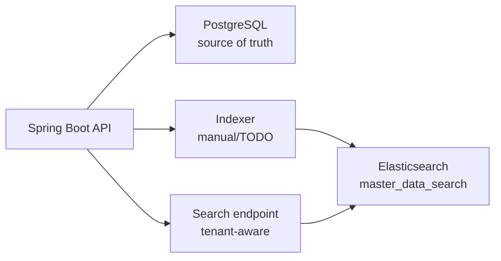

# Elasticsearch mini-lab plan cho `master_data`

## Mục tiêu

Mini-lab này giúp hiểu khi nào cần search engine sau khi đã học PostgreSQL `LIKE`, B-tree, `pg_trgm` và query pattern.

Đọc kèm:

- `docs/07-architecture/elasticsearch-search-service.md` - concept: vì sao/khi nào dùng Elasticsearch.
- `docs/07-architecture/elasticsearch-code-guide-spring-boot.md` - code shape Spring Boot cho mini-lab.
- `lab-code/elasticsearch-lab/README.md` - lệnh chạy Elasticsearch local.

Không làm:

- không xây full production search service;
- không sync bằng Kafka/Debezium trong bước đầu;
- không thêm analyzer phức tạp;
- không biến Elasticsearch thành source of truth;
- không bỏ tenant-aware repository/service.

## Target flow



Flow học tập:

1. PostgreSQL vẫn lưu `master_data`.
2. App tạo document search từ entity.
3. Document được index vào Elasticsearch.
4. Search API đọc `tenantId` từ `TenantContext`.
5. Search query luôn filter `tenantId`.

## Minimal document

Index name gợi ý:

```text
master_data_search
```

Document fields:

| Field | Nguồn từ entity | Dùng để |
|---|---|---|
| `id` | `MasterData.id` | link về DB row |
| `tenantId` | `MasterData.tenantId` | tenant filter bắt buộc |
| `code` | `MasterData.code` | exact/prefix/search keyword |
| `name` | `MasterData.name` | search keyword |
| `category` | `MasterData.category` | filter/search |
| `active` | `MasterData.isActive` | filter active data |

## Search cases cần tự code

| Case | Input | Expected |
|---|---|---|
| Tenant 1 search keyword | token tenant 1 + `keyword=Laptop` | chỉ thấy document tenant 1 |
| Tenant 2 search same keyword | token tenant 2 + `keyword=Laptop` | chỉ thấy document tenant 2 |
| Missing token | không có Bearer token | `401` từ Spring Security |
| Invalid token | token sai | `401` |
| Tenant leakage guard | query keyword chung nhiều tenant | response vẫn scoped theo tenant hiện tại |
| Compare PostgreSQL | keyword tương tự `LIKE '%Laptop%'` | giải thích vì sao search engine phù hợp hơn cho full-text |

## Verification thủ công

### 1. Start dependencies

PostgreSQL:

```bash
cd lab-code
make db-up
make db-status
```

Elasticsearch nếu có docker compose riêng:

```bash
cd lab-code/elasticsearch-lab
docker compose up -d
```

### 2. Verify Elasticsearch sống

```bash
curl http://localhost:9200
```

Expected: Elasticsearch trả JSON cluster info. Nếu bật security production-like thì cần auth, nhưng mini-lab local có thể tắt security để đơn giản hóa.

### 3. Index documents

Tự implement một trong hai hướng:

- endpoint dev/admin local để reindex `master_data`;
- hoặc service method gọi thủ công từ test/command sau này.

Gợi ý học tập:

```text
POST /api/search/master-data/reindex
```

Endpoint này nếu có chỉ nên bật khi `APP_SEARCH_ENABLED=true` và chỉ dùng lab. Production nên dùng job/event/CDC.

### 4. Search documents

Endpoint gợi ý:

```text
GET /api/search/master-data?keyword=Laptop
Authorization: Bearer <token>
```

Expected:

- token tenant 1 chỉ thấy tenant 1;
- token tenant 2 chỉ thấy tenant 2;
- thiếu/sai token bị chặn.

### 5. Update/reindex nếu cần

Khi update PostgreSQL mà search chưa đổi ngay:

- đó là dấu hiệu eventual consistency;
- cần reindex hoặc sync event;
- không kết luận Elasticsearch sai nếu chưa refresh/reindex.

### 6. Cleanup

Gợi ý cleanup index:

```bash
curl -X DELETE http://localhost:9200/master_data_search
```

Chỉ chạy trên local lab.

## Code skeleton trong repo

Chi tiết từng class nằm trong code guide:

- `docs/07-architecture/elasticsearch-code-guide-spring-boot.md`

Skeleton dự kiến:

```text
com.viettel.demo.search
├── MasterDataSearchDocument.java
├── MasterDataSearchGateway.java
├── MasterDataSearchIndexer.java
├── MasterDataSearchService.java
├── MasterDataSearchController.java
├── MasterDataSearchReindexResponse.java
└── SearchProperties.java
```

Trạng thái hiện tại:

- đã dùng official Elasticsearch Java API Client;
- search disabled mặc định bằng `APP_SEARCH_ENABLED=false`;
- reindex/search đã verify end-to-end;
- không ảnh hưởng `make app-test` khi search disabled.

## Checklist trước khi tự code

- [ ] Tôi hiểu PostgreSQL là source of truth.
- [ ] Tôi hiểu Elasticsearch index có thể stale.
- [ ] Mỗi document có `tenantId`.
- [ ] Mỗi query filter `tenantId` từ `TenantContext`.
- [ ] Tôi không dùng Elasticsearch cho exact lookup `id/code` nếu DB làm tốt hơn.
- [ ] Tôi có plan reindex/update/delete document.
- [ ] Existing tests vẫn pass khi search disabled.
