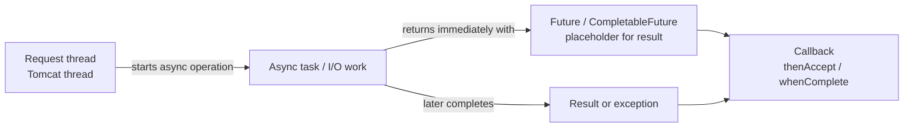
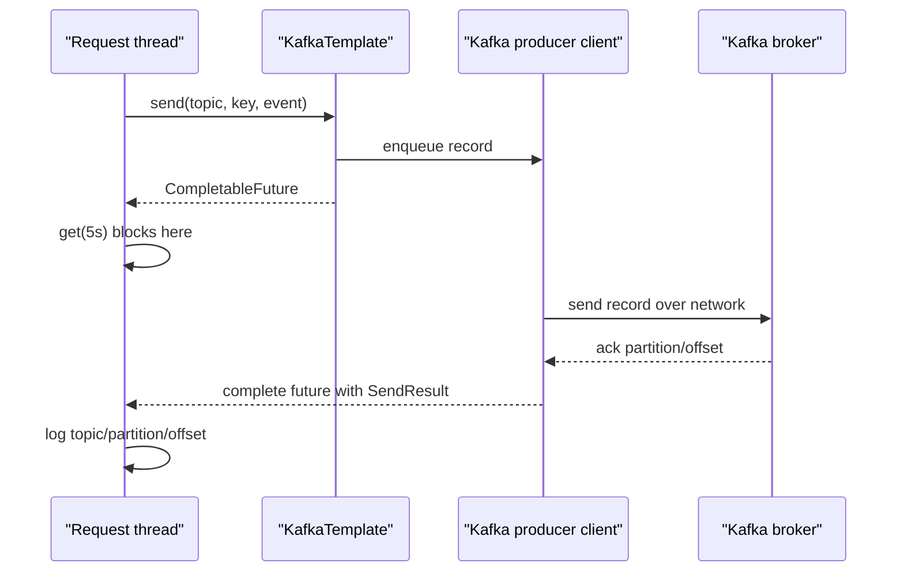

# Java async / Future / CompletableFuture trong Kafka mini-lab

## Vai trò tài liệu

Tài liệu này giải thích phần dễ gây mơ hồ trong producer:

```java
kafkaTemplate.send(topic, key, event).get(5, TimeUnit.SECONDS);
```

Mục tiêu là hiểu:

- Java có async không?
- `Future` / `CompletableFuture` là gì?
- Vì sao Kafka send là async?
- Vì sao `.get()` lại block?
- Vì sao mini-lab cố tình block ngắn để fail rõ?

---

## 1. Java có asynchronous programming không?

Có. Java hỗ trợ concurrency/async qua nhiều lớp:

- `Thread`: đơn vị chạy độc lập ở mức thấp.
- `ExecutorService`: pool nhận task và chạy bằng thread.
- `Future`: đại diện cho kết quả sẽ có sau.
- `CompletableFuture`: Future mạnh hơn, hỗ trợ callback/chaining/composition.
- Reactive libraries/virtual threads/frameworks: nâng cao hơn, chưa cần trong lab này.

Java không có cú pháp `async/await` giống JavaScript/C# trong code hiện tại. Thay vào đó, Java thường dùng:

```java
CompletableFuture<T> future = doSomethingAsync();
future.thenAccept(result -> ...);
```

hoặc block lấy kết quả:

```java
T result = future.get();
```

---

## 2. Thread, task, Future, callback



Mental model:

- Thread là người đang làm việc.
- Task là việc cần làm.
- Future là phiếu hẹn: "kết quả sẽ có sau".
- Callback là hành động chạy khi kết quả có.

---

## 3. `Future` là gì?

`Future<T>` đại diện cho kết quả của một computation có thể chưa xong.

Bạn có thể:

- hỏi task đã xong chưa;
- cancel task nếu hỗ trợ;
- gọi `get()` để chờ kết quả.

Điểm yếu của plain `Future`: khó compose/callback đẹp. Bạn thường phải block hoặc tự quản lý thread khác để poll.

---

## 4. `CompletableFuture` mạnh hơn ở đâu?

`CompletableFuture<T>` vừa là Future, vừa hỗ trợ callback/chaining:

```java
future
    .thenApply(value -> transform(value))
    .thenAccept(value -> log.info("Done {}", value))
    .exceptionally(error -> handle(error));
```

Nó phù hợp với async API vì caller không nhất thiết phải block chờ kết quả.

---

## 5. `KafkaTemplate.send(...)` trả gì?

Trong Spring Kafka version hiện tại, `KafkaTemplate.send(...)` trả về:

```java
CompletableFuture<SendResult<K, V>>
```

Trong repo:

```java
SendResult<String, MasterDataChangedEvent> result = kafkaTemplate
        .send(topic, key, event)
        .get(5, TimeUnit.SECONDS);
```

Ý nghĩa:

1. `send(...)` gửi record vào Kafka producer client.
2. Nó trả về một `CompletableFuture` đại diện cho kết quả publish.
3. Khi Kafka broker ack record, future complete thành `SendResult`.
4. Nếu publish fail, future complete bằng exception.

`SendResult` chứa metadata như topic, partition, offset.

---

## 6. Vì sao Kafka send là async?

Producer gửi message qua network tới Kafka broker. Network I/O không nên làm application thread bị kẹt lâu một cách không kiểm soát.

Kafka producer client có thread/I/O nội bộ để:

- batch records;
- gửi records qua network;
- chờ broker ack;
- retry nếu cần theo config;
- complete future khi có kết quả.

Từ góc nhìn app:

```text
request thread
-> kafkaTemplate.send(...)
-> nhận CompletableFuture ngay
-> kết quả publish đến sau
```

---

## 7. Vậy `.get()` đang làm gì?

`.get(5, TimeUnit.SECONDS)` biến async operation thành blocking wait có timeout.



Trong mini-lab, mình cố tình dùng `.get(5s)` vì:

- bạn dễ thấy Kafka unavailable thì request fail rõ;
- log có partition/offset ngay;
- flow học tập trực tiếp hơn callback;
- không giả vờ event đã gửi thành công.

Nhược điểm:

- request thread bị block trong lúc chờ Kafka ack;
- nếu Kafka chậm, API chậm;
- không phải production pattern đẹp cho mọi use case.

---

## 8. Callback-style sẽ trông thế nào?

Ví dụ không block:

```java
kafkaTemplate.send(topic, key, event)
        .whenComplete((result, error) -> {
            if (error != null) {
                log.error("Publish failed", error);
                return;
            }
            log.info("Published offset={}", result.getRecordMetadata().offset());
        });
```

Ưu điểm:

- request thread không chờ Kafka ack;
- phù hợp async fire-and-observe.

Nhược điểm trong lab:

- nếu publish fail sau khi HTTP response trả về, beginner dễ bỏ sót;
- cần thiết kế error handling/monitoring kỹ hơn;
- khó giải thích consistency nếu chưa học outbox/retry.

Vì vậy mini-lab dùng blocking wait ngắn cho clarity, không phải lời khuyên production tuyệt đối.

---

## 9. Non-blocking vs asynchronous vs concurrent

| Từ | Ý nghĩa ngắn trong context này |
|---|---|
| Concurrent | Nhiều việc có thể tiến triển trong cùng khoảng thời gian. |
| Asynchronous | Gọi operation và nhận kết quả sau, thường qua Future/callback. |
| Non-blocking | Caller không bị chặn chờ operation xong. |
| Blocking | Caller dừng lại chờ kết quả, ví dụ `.get()`. |

Kafka `send(...)` là async vì trả `CompletableFuture`.

Repo hiện tại gọi `.get(...)`, nên **producer API là async**, nhưng **code mini-lab đang block để chờ kết quả**.

Đó không mâu thuẫn. Async operation có thể bị caller biến thành blocking wait nếu caller gọi `.get()`.

---

## 10. Kết nối về code repo

File: `KafkaMasterDataEventPublisher.java`

```text
MasterDataService
-> eventPublisher.publish(event)
-> KafkaMasterDataEventPublisher.publish(event)
-> kafkaTemplate.send(topic, key, event)
-> CompletableFuture<SendResult>
-> .get(5s)
-> log partition/offset
```

Nếu Kafka chạy:

- API create/update trả success;
- producer log `Published Kafka event...`;
- consumer log `Consumed Kafka event...`.

Nếu Kafka không chạy mà `APP_MESSAGING_ENABLED=true`:

- `.get(...)` sẽ fail/timeout;
- mini-lab throw `IllegalStateException`;
- request fail rõ để bạn debug.

Nếu `APP_MESSAGING_ENABLED=false`:

- Spring dùng `NoOpMasterDataEventPublisher`;
- không gọi `KafkaTemplate`;
- `make app-test` không cần Kafka.

---

## 11. Common misunderstandings

- "Async nghĩa là không bao giờ block." Sai. Async operation vẫn có thể bị caller block bằng `.get()`.
- "KafkaTemplate.send đã gửi xong ngay." Sai. Nó mới trả future; broker ack đến sau.
- "Có future là chắc chắn thành công." Sai. Future có thể complete bằng exception.
- "Nếu API trả 201 thì event chắc chắn nằm trong Kafka." Trong repo hiện tại gần đúng vì `.get()` chờ ack. Nhưng DB/Kafka vẫn không atomic như outbox.
- "CompletableFuture tự tạo thread mới cho mọi thứ." Không luôn đúng. Nó phụ thuộc API và executor/I/O layer phía dưới.

---

## Nguồn tham khảo chuẩn

- [Java Future API](https://docs.oracle.com/en/java/javase/21/docs/api/java.base/java/util/concurrent/Future.html)
- [Java CompletableFuture API](https://docs.oracle.com/en/java/javase/21/docs/api/java.base/java/util/concurrent/CompletableFuture.html)
- [Spring Kafka - Sending Messages](https://docs.spring.io/spring-kafka/reference/kafka/sending-messages.html)
- [Kafka producer configs](https://kafka.apache.org/documentation/#producerconfigs)
