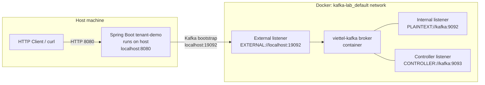

# Kafka configuration deep-dive

## Vai trò tài liệu

Tài liệu này giải thích Kafka config đang có trong repo, không phải một bài Kafka chung chung. Mục tiêu là khi mở:

- `lab-code/kafka-lab/docker-compose.yml`
- `lab-code/tenant-demo/src/main/resources/application.yml`
- `com.viettel.demo.messaging.KafkaMessagingConfig`

bạn hiểu mỗi config đang làm gì và request/event thật đi qua port nào.

Đọc trước nếu cần nền: `kafka-async-messaging.md`.

---

## 1. Bức tranh local topology



Trong repo hiện tại, Spring Boot chạy trực tiếp trên máy host, không chạy trong cùng Docker network với Kafka. Vì vậy app phải kết nối Kafka qua địa chỉ **external**:

```text
localhost:19092
```

Nếu sau này app chạy trong Docker Compose cùng network với Kafka, nó thường nên dùng địa chỉ internal:

```text
kafka:9092
```

Đây là lý do Docker Compose có cả `PLAINTEXT://kafka:9092` và `EXTERNAL://localhost:19092`.

---

## 2. Docker Compose Kafka hiện tại

File: `lab-code/kafka-lab/docker-compose.yml`

```yaml
services:
  kafka:
    image: apache/kafka:3.7.0
    container_name: viettel-kafka
    ports:
      - "19092:19092"
```

Ý nghĩa:

- `apache/kafka:3.7.0`: image Kafka official dùng cho local mini-lab.
- `container_name: viettel-kafka`: tên container để `make kafka-status` và `docker exec` dễ nhớ.
- `19092:19092`: expose port 19092 của container ra host. Spring Boot trên host gọi `localhost:19092`.

Không expose `9092` ra host vì `9092` là listener internal cho Docker network.

---

## 3. KRaft mode: broker và controller

```yaml
KAFKA_NODE_ID: 1
KAFKA_PROCESS_ROLES: controller,broker
KAFKA_CONTROLLER_QUORUM_VOTERS: 1@kafka:9093
KAFKA_CONTROLLER_LISTENER_NAMES: CONTROLLER
```

Kafka các version mới có thể chạy bằng KRaft mode, tức metadata được quản lý bởi Kafka controller, không cần ZooKeeper trong lab này.

| Config | Ý nghĩa trong lab |
|---|---|
| `KAFKA_NODE_ID: 1` | ID của node Kafka local. Một broker duy nhất nên dùng `1` là đủ. |
| `KAFKA_PROCESS_ROLES: controller,broker` | Container này vừa là broker lưu/serve records, vừa là controller quản lý metadata cluster. |
| `KAFKA_CONTROLLER_QUORUM_VOTERS: 1@kafka:9093` | Controller quorum có một voter: node 1 ở địa chỉ `kafka:9093`. |
| `KAFKA_CONTROLLER_LISTENER_NAMES: CONTROLLER` | Kafka biết listener nào dùng cho traffic controller nội bộ. |

Trong production, Kafka thường có nhiều broker/controller để chịu lỗi. Phase 1 chỉ dùng một node để học producer/consumer flow.

---

## 4. Listener vs advertised listener

Đây là phần dễ nhầm nhất.

### `KAFKA_LISTENERS`

```yaml
KAFKA_LISTENERS: PLAINTEXT://:9092,CONTROLLER://:9093,EXTERNAL://:19092
```

Nghĩa là broker **mở cổng nghe** trên các port này bên trong container:

| Listener | Port | Ai dùng |
|---|---:|---|
| `PLAINTEXT` | `9092` | Client/service trong Docker network. |
| `CONTROLLER` | `9093` | Kafka controller nội bộ KRaft. |
| `EXTERNAL` | `19092` | Client từ host machine, ví dụ Spring Boot chạy local. |

### `KAFKA_ADVERTISED_LISTENERS`

```yaml
KAFKA_ADVERTISED_LISTENERS: PLAINTEXT://kafka:9092,EXTERNAL://localhost:19092
```

Nghĩa là broker nói với client: "sau khi bootstrap, hãy dùng địa chỉ này để nói chuyện với tôi".

| Advertised listener | Dùng khi nào |
|---|---|
| `PLAINTEXT://kafka:9092` | Client trong cùng Docker network resolve được hostname `kafka`. |
| `EXTERNAL://localhost:19092` | Client trên host machine, như Spring Boot local. |

Vì Spring Boot trong repo chạy trên host, `application.yml` dùng:

```yaml
app:
  messaging:
    bootstrap-servers: ${KAFKA_BOOTSTRAP_SERVERS:localhost:19092}
```

Nếu advertised listener sai, app có thể bootstrap được bước đầu nhưng sau đó fail khi Kafka trả về metadata chứa địa chỉ app không resolve được.

---

## 5. Listener security protocol map

```yaml
KAFKA_LISTENER_SECURITY_PROTOCOL_MAP: CONTROLLER:PLAINTEXT,PLAINTEXT:PLAINTEXT,EXTERNAL:PLAINTEXT
```

Kafka cho phép mỗi listener map sang một security protocol. Lab này dùng `PLAINTEXT` cho tất cả để đơn giản:

- không TLS;
- không SASL/user/password;
- chỉ local learning.

Production sẽ cần security khác: TLS, SASL/OAuth, network boundary, ACL...

---

## 6. Topic/offset replication settings

```yaml
KAFKA_AUTO_CREATE_TOPICS_ENABLE: true
KAFKA_OFFSETS_TOPIC_REPLICATION_FACTOR: 1
KAFKA_TRANSACTION_STATE_LOG_REPLICATION_FACTOR: 1
KAFKA_TRANSACTION_STATE_LOG_MIN_ISR: 1
KAFKA_GROUP_INITIAL_REBALANCE_DELAY_MS: 0
```

| Config | Vì sao có trong local lab |
|---|---|
| `KAFKA_AUTO_CREATE_TOPICS_ENABLE: true` | Khi app publish/subscribe topic `master-data-events`, Kafka có thể tự tạo topic nếu chưa tồn tại. Dễ cho mini-lab. |
| `KAFKA_OFFSETS_TOPIC_REPLICATION_FACTOR: 1` | Consumer group offset lưu trong internal topic. Vì chỉ có 1 broker nên replication factor phải là 1. |
| `KAFKA_TRANSACTION_STATE_LOG_REPLICATION_FACTOR: 1` | Internal topic cho transaction state. Local 1 broker nên để 1. |
| `KAFKA_TRANSACTION_STATE_LOG_MIN_ISR: 1` | Minimum in-sync replica cho transaction state. Local 1 broker nên để 1. |
| `KAFKA_GROUP_INITIAL_REBALANCE_DELAY_MS: 0` | Consumer group rebalance nhanh hơn trong local lab. |

Lab này không dùng Kafka transaction thật, nhưng một số internal topic vẫn cần config phù hợp 1 broker.

---

## 7. Healthcheck

```yaml
healthcheck:
  test: ["CMD-SHELL", "/opt/kafka/bin/kafka-topics.sh --bootstrap-server localhost:9092 --list >/dev/null 2>&1"]
```

Healthcheck chạy **bên trong container**, nên dùng internal broker address:

```text
localhost:9092
```

Nó không dùng `localhost:19092` vì `19092` là external listener cho host. Bên trong container, `localhost:19092` vẫn có thể nghe, nhưng dùng internal `9092` rõ ý hơn.

---

## 8. Spring Boot config map sang runtime

File: `lab-code/tenant-demo/src/main/resources/application.yml`

```yaml
app:
  messaging:
    enabled: ${APP_MESSAGING_ENABLED:false}
    bootstrap-servers: ${KAFKA_BOOTSTRAP_SERVERS:localhost:19092}
    master-data-topic: ${KAFKA_MASTER_DATA_TOPIC:master-data-events}
    consumer-group-id: ${KAFKA_CONSUMER_GROUP_ID:tenant-demo-master-data}
```

Map sang code:

| YAML field | Java class/method | Dùng ở đâu |
|---|---|---|
| `app.messaging.enabled` | `MessagingProperties.isEnabled()` và `@ConditionalOnProperty` | Bật/tắt Kafka producer/consumer beans. |
| `bootstrap-servers` | `properties.getBootstrapServers()` | ProducerFactory và ConsumerFactory kết nối Kafka. |
| `master-data-topic` | `properties.getMasterDataTopic()` và `@KafkaListener(topics = ...)` | Topic publish/consume. |
| `consumer-group-id` | `properties.getConsumerGroupId()` và `@KafkaListener(groupId = ...)` | Consumer group của listener. |

Khi `APP_MESSAGING_ENABLED=false`:

```text
MasterDataService
-> MasterDataEventPublisher
-> NoOpMasterDataEventPublisher
-> không cần Kafka
```

Khi `APP_MESSAGING_ENABLED=true`:

```text
MasterDataService
-> MasterDataEventPublisher
-> KafkaMasterDataEventPublisher
-> KafkaTemplate
-> Kafka broker localhost:19092
```

---

## 9. Spring Kafka config trong repo

File: `KafkaMessagingConfig.java`

Producer:

```java
config.put(ProducerConfig.BOOTSTRAP_SERVERS_CONFIG, properties.getBootstrapServers());
config.put(ProducerConfig.KEY_SERIALIZER_CLASS_CONFIG, StringSerializer.class);
config.put(ProducerConfig.VALUE_SERIALIZER_CLASS_CONFIG, JsonSerializer.class);
config.put(JsonSerializer.ADD_TYPE_INFO_HEADERS, false);
```

Ý nghĩa:

- key là String: `tenant:1:master-data:7`;
- value là `MasterDataChangedEvent`, serialize thành JSON;
- không thêm type headers để payload dễ nhìn và consumer tự biết default type.

Consumer:

```java
config.put(ConsumerConfig.KEY_DESERIALIZER_CLASS_CONFIG, StringDeserializer.class);
config.put(ConsumerConfig.VALUE_DESERIALIZER_CLASS_CONFIG, JsonDeserializer.class);
config.put(JsonDeserializer.VALUE_DEFAULT_TYPE, MasterDataChangedEvent.class.getName());
config.put(JsonDeserializer.USE_TYPE_INFO_HEADERS, false);
```

Ý nghĩa:

- key đọc lại là String;
- value JSON deserialize về `MasterDataChangedEvent`;
- vì producer không gửi type header, consumer cần biết default type.

---

## 10. Common mistakes khi đọc config này

- Nhầm `LISTENERS` với `ADVERTISED_LISTENERS`.
- App chạy trên host nhưng lại dùng `kafka:9092`; hostname `kafka` chỉ resolve trong Docker network.
- App chạy trong Docker network nhưng lại dùng `localhost:19092`; lúc đó `localhost` là container app, không phải Kafka.
- Expose port 9092 ra host rồi advertised sai địa chỉ.
- Quên `APP_MESSAGING_ENABLED=false` làm test local cần Kafka.
- Nghĩ `PLAINTEXT` là production-safe. Nó chỉ phù hợp local lab.

---

## 11. Cách đọc code với config này trong đầu

1. Mở `docker-compose.yml`: xác định Kafka local đang expose gì.
2. Mở `application.yml`: xem app sẽ bootstrap vào đâu.
3. Mở `MessagingProperties`: kiểm tra field bind từ YAML.
4. Mở `KafkaMessagingConfig`: xem key/value serializer và deserializer.
5. Mở `KafkaMasterDataEventPublisher`: xem topic/key/value được gửi thế nào.
6. Mở `MasterDataChangedEventConsumer`: xem app consume topic nào và group id nào.

---

## Nguồn tham khảo chuẩn

- [Apache Kafka documentation](https://kafka.apache.org/documentation/)
- [Apache Kafka broker configs](https://kafka.apache.org/documentation/#brokerconfigs)
- [Spring Kafka reference](https://docs.spring.io/spring-kafka/reference/)
