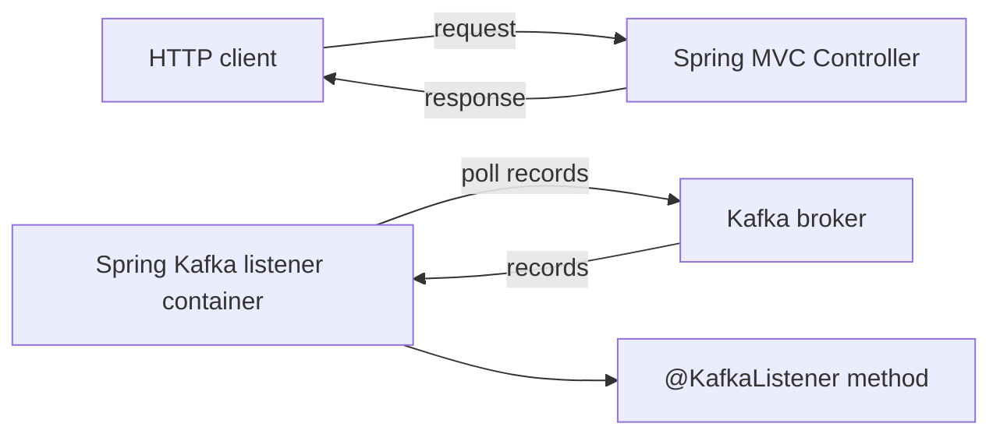
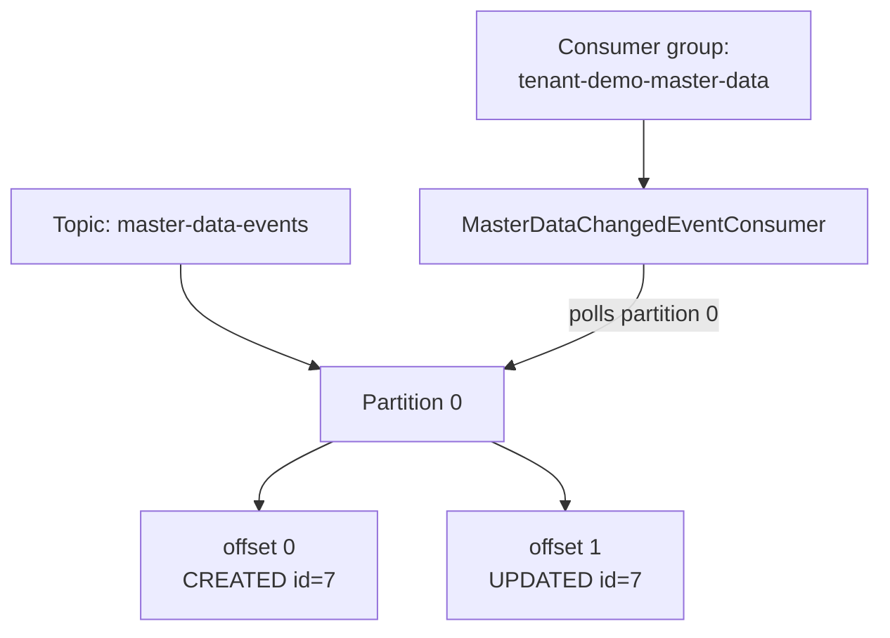
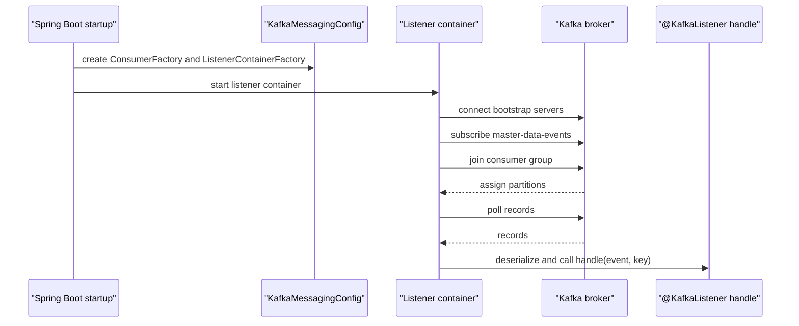
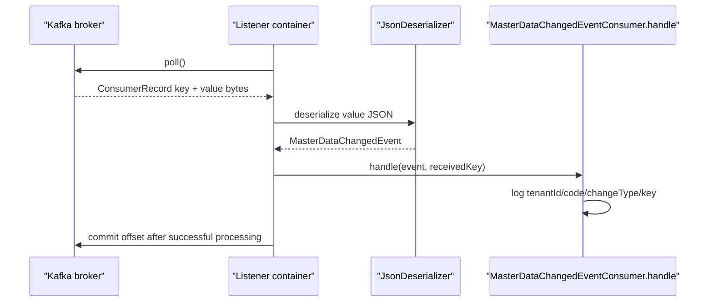

# Kafka listener / consumer flow deep-dive

## Vai trò tài liệu

Tài liệu này giải thích phần consumer của Kafka mini-lab:

- `@KafkaListener` là gì;
- listener container chạy thế nào;
- topic/partition/offset/group id nghĩa là gì;
- consumer nhận message khác HTTP controller ra sao;
- JSON event được deserialize về Java record thế nào.

File code chính:

- `MasterDataChangedEventConsumer.java`
- `KafkaMessagingConfig.java`

---

## 1. Consumer không giống HTTP controller

HTTP controller:

```text
Client gửi request
-> server mở port HTTP
-> controller method được gọi
-> trả response ngay
```

Kafka consumer:

```text
Consumer chủ động poll Kafka broker
-> nhận records từ topic/partition
-> deserialize key/value
-> gọi listener method
-> commit offset
```

Consumer không "mở endpoint HTTP" để Kafka gọi vào. Consumer là client kết nối tới Kafka và poll message.



---

## 2. `@KafkaListener` làm gì?

Code trong repo:

```java
@KafkaListener(
        topics = "${app.messaging.master-data-topic}",
        groupId = "${app.messaging.consumer-group-id}",
        containerFactory = "masterDataKafkaListenerContainerFactory"
)
public void handle(
        @Payload MasterDataChangedEvent event,
        @Header(name = KafkaHeaders.RECEIVED_KEY, required = false) String key
) {
    ...
}
```

Ý nghĩa:

- Spring thấy method có `@KafkaListener`.
- Spring tạo listener container cho method đó.
- Container dùng `ConsumerFactory` để tạo Kafka consumer thật.
- Consumer subscribe topic `master-data-events`.
- Khi poll được record, Spring deserialize value thành `MasterDataChangedEvent`.
- Spring gọi `handle(event, key)`.

Bạn không tự viết vòng lặp poll trong business code; Spring Kafka listener container làm việc đó.

---

## 3. Listener container là gì?

Listener container là object chạy nền do Spring Kafka quản lý.

Nó chịu trách nhiệm:

- tạo Kafka consumer;
- subscribe topic;
- poll records;
- gọi listener method;
- xử lý commit offset theo mode mặc định/config;
- quản lý lifecycle khi app start/stop.

Trong repo:

```java
ConcurrentKafkaListenerContainerFactory<String, MasterDataChangedEvent>
```

Factory này tạo container cho `@KafkaListener`.

---

## 4. Topic, partition, offset, consumer group



| Concept | Trong repo |
|---|---|
| Topic | `master-data-events` |
| Partition | Local auto-created topic thường có partition mặc định. Manual có thể tạo 1 partition. |
| Offset | Vị trí record trong partition. Log producer có offset `0`, `1` khi verify. |
| Consumer group | `tenant-demo-master-data` |
| Listener | `MasterDataChangedEventConsumer.handle(...)` |

Kafka giữ order trong **một partition**, không đảm bảo global order trên mọi partition.

---

## 5. Group id có tác dụng gì?

`groupId = tenant-demo-master-data` nghĩa là các consumer instance cùng group sẽ chia nhau partitions.

Ví dụ nếu topic có 3 partitions và có 3 app instances cùng group:

```text
partition 0 -> instance A
partition 1 -> instance B
partition 2 -> instance C
```

Trong mini-lab chỉ có một app instance, nên nó nhận partition topic hiện có.

Nếu đổi group id, Kafka coi đó là một consumer group mới và có thể đọc lại message từ offset theo `auto.offset.reset`.

---

## 6. Offset và acknowledgment ở mức beginner

Offset là vị trí đã đọc tới trong partition.

Consumer group lưu offset để biết lần sau đọc tiếp từ đâu.

Spring Kafka mặc định thường commit offset sau khi listener xử lý record thành công, tùy container ack mode/config. Mini-lab không cấu hình ack mode riêng để tránh quá tải.

Điều quan trọng:

- nếu consumer xử lý fail trước commit, message có thể được đọc lại;
- vì vậy consumer nên idempotent;
- mini-lab hiện chỉ log nên duplicate không nguy hiểm;
- production cần chiến lược retry/DLT/idempotency rõ ràng.

---

## 7. Deserialization trong repo

Producer gửi:

```java
KafkaTemplate<String, MasterDataChangedEvent>
```

Config producer:

```java
StringSerializer
JsonSerializer
JsonSerializer.ADD_TYPE_INFO_HEADERS = false
```

Consumer đọc:

```java
StringDeserializer
JsonDeserializer
JsonDeserializer.VALUE_DEFAULT_TYPE = MasterDataChangedEvent.class.getName()
JsonDeserializer.USE_TYPE_INFO_HEADERS = false
```

Nghĩa là:

- key bytes -> String;
- value JSON -> `MasterDataChangedEvent`;
- vì producer không gửi type header, consumer dùng default type.

Nếu event shape đổi mà consumer class không đổi tương thích, deserialize có thể fail.

---

## 8. Consumer startup flow



Trong log verify bạn đã thấy các ý như:

- subscribed to topic;
- discovered group coordinator;
- joined group;
- partitions assigned.

Đó là listener container đang join consumer group.

---

## 9. Consumer flow khi có event



Mini-lab handler chỉ log:

```text
Consumed Kafka event eventId=..., tenantId=1, aggregateId=7, changeType=CREATED, key=tenant:1:master-data:7
```

---

## 10. `auto.offset.reset = earliest`

Config trong repo:

```java
config.put(ConsumerConfig.AUTO_OFFSET_RESET_CONFIG, "earliest");
```

Ý nghĩa: nếu consumer group chưa có offset đã commit, đọc từ đầu topic.

Điều này hữu ích cho lab vì khi group mới được tạo, bạn dễ thấy message cũ nếu topic vẫn còn.

Nhưng nếu group đã commit offset rồi, `earliest` không ép đọc lại từ đầu. Muốn đọc lại, cần group mới hoặc reset offset.

---

## 11. Common mistakes

- Nghĩ Kafka gọi vào app giống webhook/HTTP. Thực tế consumer poll Kafka.
- Quên group id nên không hiểu vì sao message không đọc lại.
- Đổi group id rồi thấy message cũ xuất hiện lại, tưởng Kafka duplicate bất thường.
- Event deserialize fail vì producer/consumer không thống nhất JSON/type.
- Consumer xử lý duplicate không an toàn.
- Làm business logic nặng trong listener ngay từ đầu.
- Quên tenantId trong event và consumer ghi projection không tenant-aware.

---

## 12. Cách đọc code với consumer concept

1. Mở `KafkaMessagingConfig`: tìm `ConsumerFactory`.
2. Xem deserializer: key String, value JSON -> `MasterDataChangedEvent`.
3. Xem `masterDataKafkaListenerContainerFactory`: factory tạo listener container.
4. Mở `MasterDataChangedEventConsumer`: đọc `@KafkaListener`.
5. Nhớ rằng method `handle(...)` không được gọi bởi controller; nó được listener container gọi sau khi poll Kafka.

---

## Nguồn tham khảo chuẩn

- [Spring Kafka - Receiving Messages](https://docs.spring.io/spring-kafka/reference/kafka/receiving-messages.html)
- [Spring Kafka - Annotated Listeners](https://docs.spring.io/spring-kafka/reference/kafka/receiving-messages/listener-annotation.html)
- [Apache Kafka Consumer configs](https://kafka.apache.org/documentation/#consumerconfigs)
- [Apache Kafka documentation](https://kafka.apache.org/documentation/)
