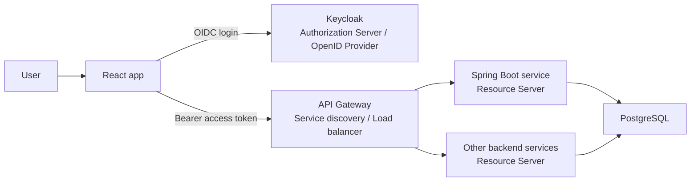
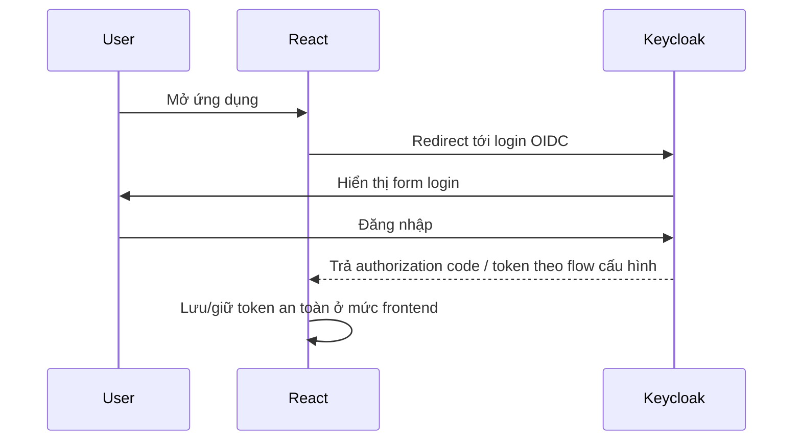
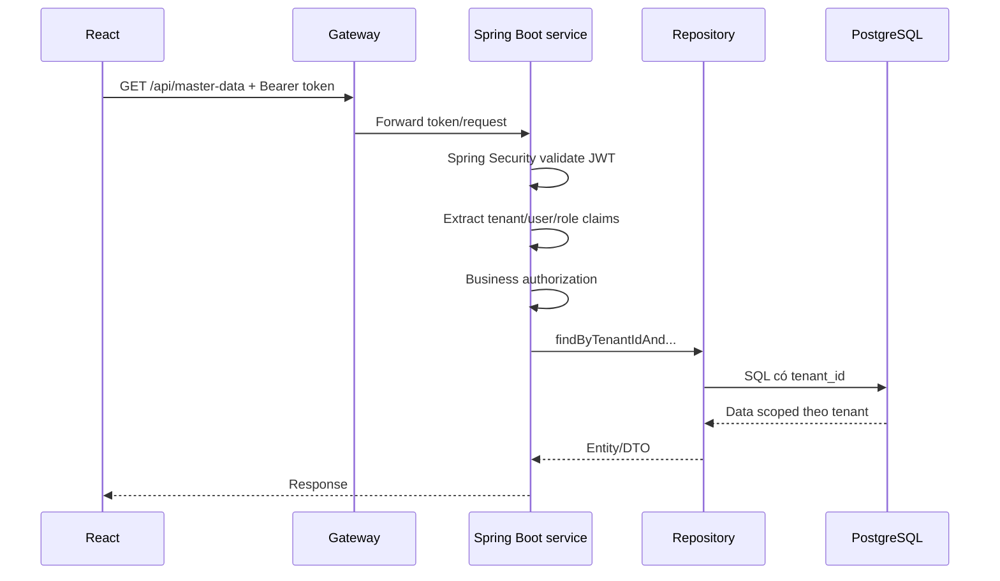
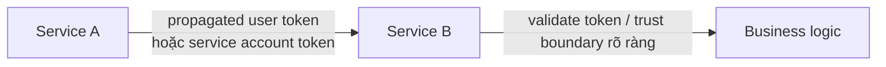

# Keycloak/OIDC trong kiến trúc target

## Mục tiêu

Tài liệu này nối mini-lab Keycloak hiện tại với kiến trúc target kiểu Viettel: React frontend, API Gateway, nhiều backend service, PostgreSQL, Kafka/Redis/MinIO/Elastic và các hệ thống ngoài.

Đọc trước nếu cần nền:

- `docs/05-security/keycloak-oidc-mental-model.md`
- `docs/05-security/keycloak-admin-console-guide.md`
- `docs/05-security/spring-boot-keycloak-integration-plan.md`

Phạm vi hiện tại: hiểu vai trò và flow. Không triển khai full IAM/RBAC production trong Phase 1.

## 1. Keycloak nằm ở đâu trong kiến trúc?



Vai trò chính:

| Thành phần | Vai trò trong auth |
|---|---|
| Keycloak | Authorization Server / OpenID Provider: quản lý realm, user, client, role/group, phát token. |
| React app | OAuth2/OIDC client: điều hướng user login, nhận token, gọi API bằng Bearer token. |
| API Gateway | Lớp vào hệ thống: có thể kiểm tra token, route request, rate limit, logging. |
| Spring Boot service | Resource Server: validate token, đọc claims, enforce business authorization và tenant-aware access. |
| Authorization/RBAC service | Nơi có thể giữ rule phân quyền nghiệp vụ phức tạp nếu Keycloak roles/scopes chưa đủ. |

Keycloak làm tốt phần xác thực, quản lý identity và phát token. Keycloak **không tự động** bảo đảm repository query đúng tenant, không hiểu hết rule nghiệp vụ kế toán và không thay thế authorization ở domain/service layer.

## 2. Flow thực tế

### Flow A - User login từ React



Trong production frontend, hướng nên học sau là Authorization Code + PKCE. Không dùng password grant cho React production.

### Flow B - API call từ React tới backend



Điểm cần nhớ: token claim chỉ cung cấp context sau khi validate. Data isolation vẫn cần query theo `tenantId`.

### Flow C - Internal service call



Hai hướng phổ biến ở mức awareness:

| Cách gọi | Khi nào dùng | Lưu ý |
|---|---|---|
| Propagate user token | Service B cần biết user/tenant/role gốc của request. | Phải cẩn thận audience, scope, token lifetime và không lạm dụng token frontend. |
| Service account / client credentials | Job/service gọi nhau không đại diện trực tiếp cho user. | Cần quyền service rõ ràng; nếu thao tác theo tenant vẫn phải truyền/kiểm tra tenant context hợp lệ. |

Phase 1 chỉ cần hiểu pattern, chưa cần implement service-to-service security.

### Flow D - Mapping với lab hiện tại

```text
Keycloak local
-> access token có tenant_id
-> tenant-demo chạy APP_AUTH_MODE=keycloak
-> Spring Security validate issuer/JWKS
-> JwtTenantContextFilter đọc tenant_id
-> TenantContext
-> MasterDataService
-> MasterDataRepository query tenant-aware
```

Lab hiện tại là một lát cắt nhỏ của kiến trúc target: một backend service đóng vai Resource Server và một bảng `master_data` thay cho domain data thật.

## 3. Realm và client design

### Realm per environment/product, không vội realm per tenant

Mental model phù hợp Phase 1:

```text
Realm: viettel-sme-dev
|
|-- Users
|-- Clients
|-- Roles / Groups
|-- Client scopes / Mappers
```

Khuyến nghị đơn giản:

- Một realm cho một product/environment, ví dụ `viettel-sme-dev`, `viettel-sme-staging`, `viettel-sme-prod`.
- Tenant được biểu diễn bằng claim/group/attribute/mapping trong realm, không tạo một realm riêng cho mỗi tenant ngay từ đầu.
- Realm per tenant chỉ nên cân nhắc khi cần isolation IAM cực mạnh, policy hoàn toàn khác nhau, hoặc yêu cầu enterprise riêng; đổi lại vận hành và cấu hình phức tạp hơn nhiều.

### Các client nên có

| Client | Đại diện cho gì | Ghi chú |
|---|---|---|
| `sme-react-frontend` | React app | Public client, production nên dùng Authorization Code + PKCE. |
| `sme-api` hoặc audience/resource config | Backend API layer | Dùng để biểu diễn API/resource/audience nếu thiết kế cần. |
| `service-a-to-service-b` | Service-to-service | Có thể dùng service account/client credentials khi cần. |
| `tenant-demo-api-client` | HTTP Client/dev mini-lab | Chỉ phục vụ học local, không phải production client. |

User không nằm trong client. User và client cùng thuộc realm. User đăng nhập thông qua client để lấy token, còn client là ứng dụng/tool/service.

## 4. User, tenant và role model

Có nhiều cách đưa tenant context vào token:

| Cách | Ưu điểm | Nhược điểm | Hợp với |
|---|---|---|---|
| User attribute `tenant_id` | Rất đơn giản, dễ học. | Chỉ hợp user một tenant; khó biểu diễn nhiều tenant/role. | Phase 1 lab. |
| Group theo tenant, ví dụ `tenant-1` | Dễ gán user vào nhiều nhóm. | Cần mapper và convention rõ; group list có thể dài. | Awareness/mini-lab sau. |
| Claim `tenant_ids` / `tenant_codes` | Hỗ trợ user thuộc nhiều tenant. | Token có thể to; vẫn cần chọn tenant active. | Product thật có multi-tenant user. |
| Realm roles | Quyền global trong realm. | Không đủ để biểu diễn quyền theo từng tenant. | Platform/admin roles đơn giản. |
| Client roles | Quyền theo từng application/API client. | Cần mapping sang rule backend. | API-specific permissions. |
| Authorization service/backend DB | Rule nghiệp vụ linh hoạt. | Phải tự xây logic và test. | ERP/accounting production. |

Recommendation:

- Phase 1: dùng `tenant_id` claim một tenant để hiểu flow.
- Gần production hơn: user có thể thuộc nhiều tenant; sau login cần chọn active tenant, rồi token/session/request context có active tenant.
- Production authorization: Keycloak cung cấp identity/roles/scopes; backend hoặc authorization service quyết định rule nghiệp vụ chi tiết.

Token claim là context đã được xác thực, nhưng chưa đủ để kết luận mọi quyền. Ví dụ có `tenant_id = 1` không có nghĩa user được sửa mọi chứng từ tenant 1.

## 5. RBAC và tenant-scope

```text
AuthN: Bạn là ai?
AuthZ: Bạn được làm gì, trong phạm vi tenant nào?
```

Trong kiến trúc target:

- Keycloak xác thực user và có thể phát roles/scopes.
- API Gateway/backend kiểm tra request có token hợp lệ.
- Backend service vẫn cần check rule nghiệp vụ.
- Authorization/RBAC service có thể gom các rule phức tạp nếu nhiều service cần dùng chung.

Ví dụ:

```text
User A có role ACCOUNTANT trong tenant 1
-> được đọc invoice tenant 1
-> không được đọc invoice tenant 2
-> chưa chắc được duyệt payment nếu thiếu quyền APPROVER
```

Vì vậy tenant-aware repository là lớp bảo vệ dữ liệu, còn RBAC/domain authorization là lớp bảo vệ hành động.

## 6. Keycloak với API Gateway

Gateway có thể:

- kiểm tra token sớm để chặn request rác;
- route theo service;
- ghi log/metric;
- rate limit;
- truyền token xuống backend.

Nhưng backend service vẫn nên validate token hoặc chỉ trust gateway khi có boundary nội bộ rất rõ: network private, mTLS/service identity, header signing hoặc policy vận hành chặt. Với Phase 1, cách dễ hiểu nhất là giữ backend Spring Boot làm Resource Server và tự validate Bearer token.

Không nên overclaim rằng “Gateway validate rồi backend không cần quan tâm auth”. Điều này chỉ đúng trong một số kiến trúc có trust boundary được thiết kế nghiêm túc.

## 7. Claims cần quan tâm

| Claim | Ý nghĩa | Cần hiện tại? |
|---|---|---|
| `iss` | Issuer phát token. Backend dùng để biết token đến từ đúng realm. | Có |
| `sub` | Subject/user id ổn định trong issuer. | Có, để trace user. |
| `aud` | Audience/token intended for resource nào. | Nên học tiếp trước production. |
| `exp` | Thời điểm hết hạn token. | Có |
| `scope` | Scope OAuth2 được cấp. | Biết qua |
| `realm_access.roles` | Realm roles của user. | Sau này khi học RBAC. |
| `resource_access.{client}.roles` | Client roles theo client/API. | Sau này khi học RBAC. |
| `tenant_id` | Tenant active trong lab. | Có |
| `tenant_ids` / `tenant_codes` | Danh sách tenant user thuộc về. | Sau này nếu user nhiều tenant. |
| `preferred_username`, `email` | Thông tin hiển thị/tracing. | Biết qua, không dùng làm security decision chính. |
| `groups` | Group membership nếu mapper đưa vào token. | Sau này nếu dùng group-per-tenant. |

Các claim dùng cho security decision phải được lấy từ token đã validate, không lấy từ request body/frontend state.

## 8. Production caveats

Những điểm Phase 1 chỉ cần biết, chưa implement:

- Dùng HTTPS bắt buộc.
- React production nên dùng Authorization Code + PKCE, không dùng password grant.
- Không có dev token endpoint trong production.
- Quản lý token lifetime và refresh token cẩn thận.
- JWKS/key rotation phải được hiểu và test.
- Audience validation quan trọng khi có nhiều API/service.
- Logout/session management là bài riêng.
- Realm config nên có export/import/versioning, không setup tay mãi.
- Có thể cần user federation/LDAP/AD/SSO sau này.
- Role/permission nghiệp vụ kế toán không nên nhồi hết vào token nếu quá phức tạp.

## 9. Mapping từ repo hiện tại sang kiến trúc production

| Current lab component | Equivalent production concept | Đã implement | Awareness / chưa làm |
|---|---|---|---|
| `DevTokenController` | Không có trong production; thay bằng Keycloak login/token endpoint. | Có cho local JWT fallback. | Sẽ không dùng production. |
| `lab-code/keycloak-lab` | Local Keycloak/OIDC learning environment. | Có mini-lab. | Chưa có realm import/export chuẩn. |
| `APP_AUTH_MODE=keycloak` | Backend Resource Server validate issuer/JWKS. | Đã verify. | Chưa có automated Keycloak integration test. |
| `JwtTenantContextFilter` | Bridge từ validated authentication sang request tenant context. | Có. | Cần harden nếu user nhiều tenant. |
| `TenantContext` | Request-scoped tenant context trong backend service. | Có. | Cần chuẩn hóa propagation/logging sau. |
| `MasterDataService` | Business service layer. | Có slice nhỏ. | Chưa có domain ERP thật. |
| `MasterDataRepository` | Tenant-aware data access. | Có explicit tenant methods. | Có thể cần base convention/test rộng hơn. |
| `tenant_id` user attribute mapper | Cách đơn giản đưa tenant vào token. | Có trong mini-lab. | Production có thể dùng groups/mapping/authorization service. |
| `DataLeakageTest` | Regression test chống cross-tenant leakage. | Có local JWT mode. | Chưa chạy test tự động với live Keycloak. |
| API Gateway trong sơ đồ | Protected entry layer. | Chưa implement. | Awareness: gateway có thể validate/pass token. |
| Authorization/RBAC service | Business authorization tập trung. | Chưa implement. | Nên học sau khi có RBAC use case. |
| React app | OAuth2/OIDC client. | Chưa implement. | Có thể làm Milestone #10 nếu còn thời gian. |

## 10. Best next task

Khuyến nghị tiếp theo: **backend demo script trước, React UI sau nếu còn thời gian**.

Lý do:

- Keycloak tenant flow đã verify ở backend; nên đóng gói thành demo mentor-facing chắc chắn.
- React UI sẽ mở thêm scope: CORS, frontend token handling, Authorization Code + PKCE, UI state.
- Nếu làm UI ngay, dễ mất thời gian vào frontend thay vì chứng minh flow kiến trúc đã học.

Task cụ thể:

1. Dry-run `presentation-notes/demo-script-keycloak-tenant-flow.md`.
2. Ghi lại pattern verify ngắn: token tenant 1/2, missing/invalid token, cross-tenant id.
3. Nếu còn thời gian, tạo note `docs/06-frontend/react-tenant-demo-ui.md` rồi mới scaffold UI nhỏ.

## Nguồn tham khảo chuẩn

- [Keycloak - Securing applications and services](https://www.keycloak.org/docs/latest/securing_apps/index.html)
- [Keycloak - Server Administration Guide](https://www.keycloak.org/docs/latest/server_admin/)
- [Spring Security - OAuth2 Resource Server JWT](https://docs.spring.io/spring-security/reference/servlet/oauth2/resource-server/jwt.html)
- [OpenID Connect Core 1.0](https://openid.net/specs/openid-connect-core-1_0.html)
- [OpenID Connect Discovery 1.0](https://openid.net/specs/openid-connect-discovery-1_0.html)
- [RFC 6750 - Bearer Token Usage](https://www.rfc-editor.org/rfc/rfc6750)

