# Grafana Loki UI Screenshot Guide

Guide này dùng screenshot thật từ Grafana Explore để chỉ cách đọc centralized logs trong Phase 1.5 demo. Mục tiêu là học thao tác UI: chọn datasource, chọn label, chạy query, đọc log line và narrowing bằng text filter.

## 1. Purpose

Khi hệ thống có Gateway, business service, Kafka consumer và frontend container, đọc log từng terminal rất dễ rối. Grafana Loki giúp gom logs về một nơi để backend engineer đọc theo service/layer, requestId, business code, status hoặc error keyword.

## 2. Local logging model in this repo

`tenant-demo` thường chạy bằng Maven/IntelliJ trên host:

```text
tenant-demo runs on host Maven/IntelliJ
  -> writes lab-code/logs/tenant-demo.log
  -> Alloy file source
  -> Loki
  -> Grafana Explore
```

Các service Docker ghi stdout:

```text
Docker services
  -> Docker stdout
  -> Alloy Docker source
  -> Loki
  -> Grafana Explore
```

Vì vậy mô hình local tốt nhất của repo này là hybrid: Java service vẫn thuận tiện chạy host, còn Loki vẫn đọc được qua file log; Docker services vẫn dùng stdout.

## 3. What backend engineers usually slice logs by

- `service/layer`: gateway, business service, async consumer, frontend container.
- `source`: `file` cho host-run Java logs, `docker` cho container stdout.
- `requestId`: trace một HTTP request cụ thể.
- Business key: code, eventId, aggregateId khi flow đi qua Kafka async.
- HTTP status: `201`, `409`, `403`, `500`.
- Error keyword: `ERROR`, exception name, failed component.
- Time window: thường bắt đầu bằng `Last 5 minutes` hoặc `Last 15 minutes`.

## 4. Screenshot walkthrough

### Step 1 - Grafana login

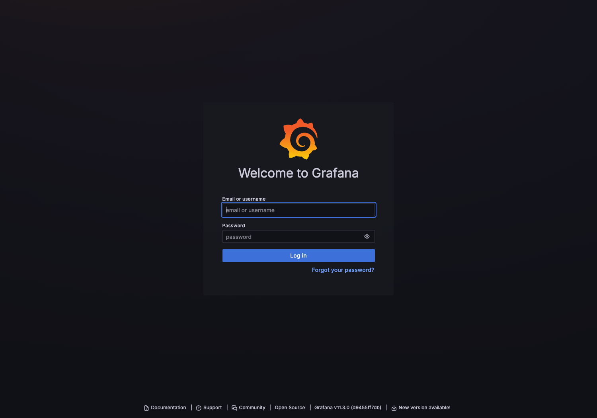

Local lab dùng `admin / admin`. Đây là credential demo local, không dùng cho production.

### Step 2 - Open Explore and select Loki

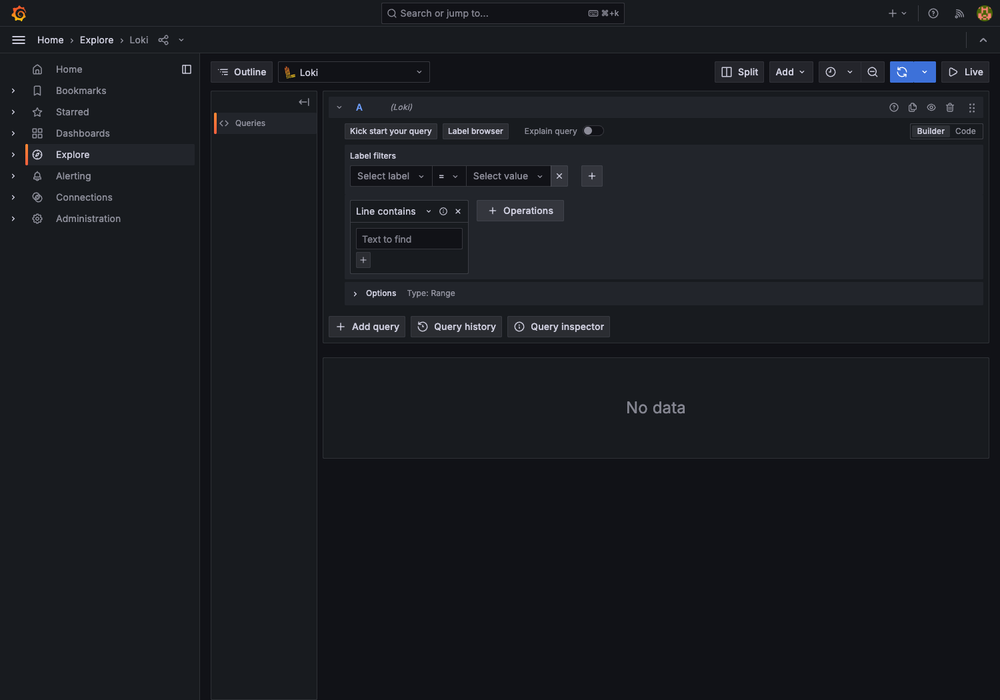

Điểm cần nhìn:

- Sidebar đang ở `Explore`.
- Datasource dropdown đang chọn `Loki`.
- Query mode có `Builder` và `Code`.
- `Label filters` cho phép chọn label/value bằng UI.

### Step 3 - Use label selector for `service`

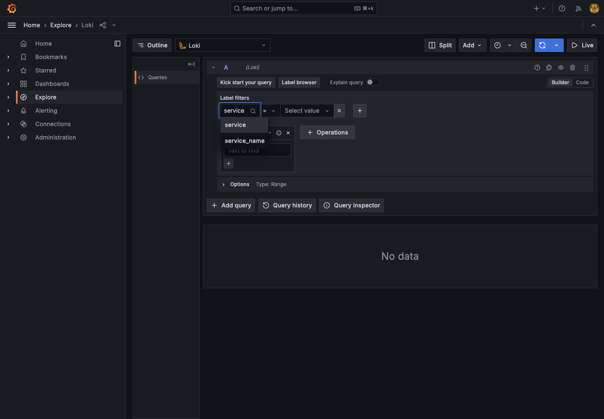

Bạn không cần nhớ hết label. Trong Builder mode, mở label selector rồi gõ/chọn `service`. Grafana gợi ý label có thật trong Loki. Sau đó chọn value như `tenant-demo`, `audit-log-service`, `kong-gateway`, hoặc `web-ui-demo`.

### Step 4 - Query all main services

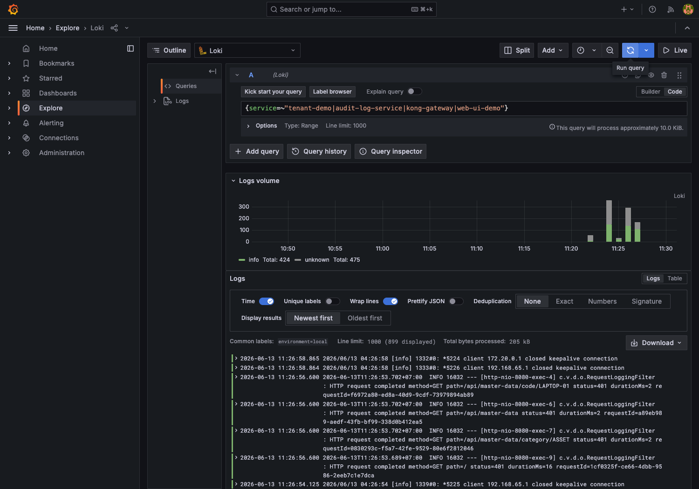

LogQL:

```logql
{service=~"tenant-demo|audit-log-service|kong-gateway|web-ui-demo"}
```

Query này dùng để kiểm tra tổng quan: các service có đang phát log không. Nó hữu ích khi bắt đầu demo, nhưng hơi nhiễu để debug sâu.

### Step 5 - Read `tenant-demo` logs

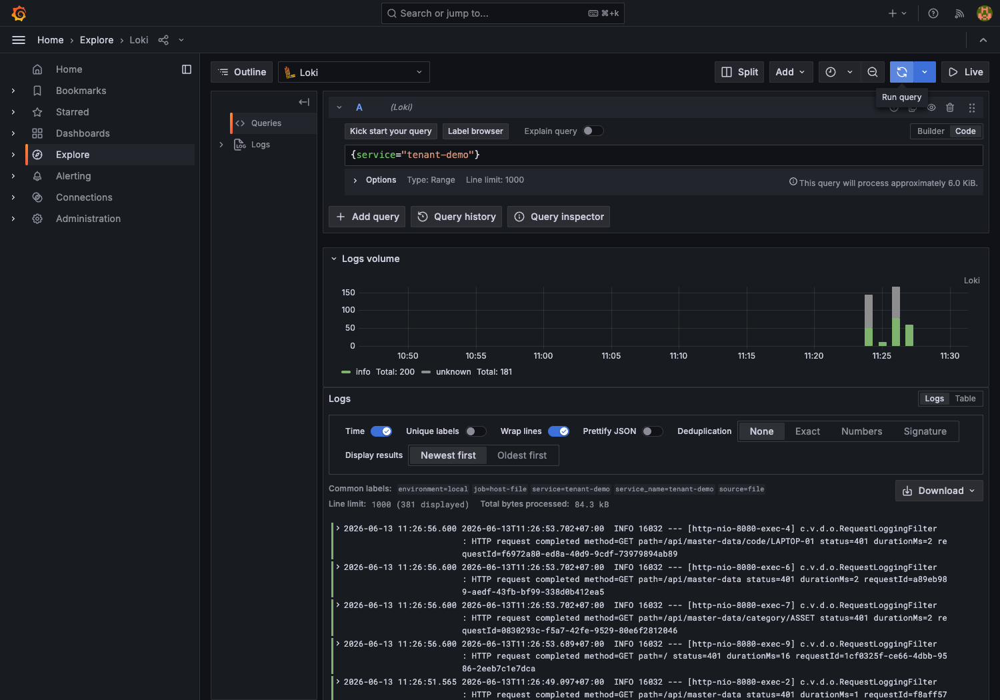

LogQL:

```logql
{service="tenant-demo"}
```

Đây là business API service. Trong repo này, logs đến từ `lab-code/logs/tenant-demo.log` vì app chạy host Maven bằng `make app-run-logs`. Dùng query này để xem auth/RBAC, tenant context, DB behavior, Redis cache, Kafka publish.

### Step 6 - Read `audit-log-service` logs

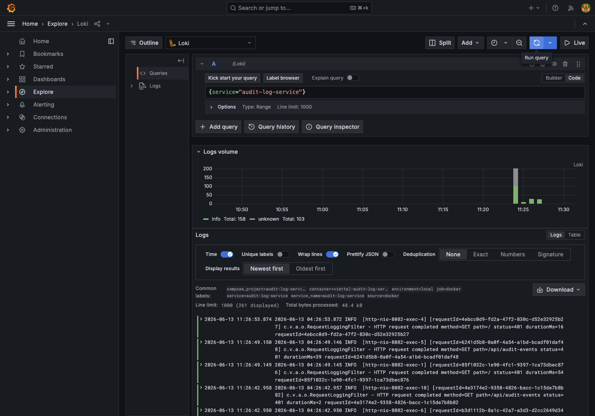

LogQL:

```logql
{service="audit-log-service"}
```

Đây là async Kafka consumer service. Dùng query này để xem `MasterDataChangedEvent` đã được consume/store chưa và audit API có filter tenant đúng không.

### Step 7 - Trace by business code

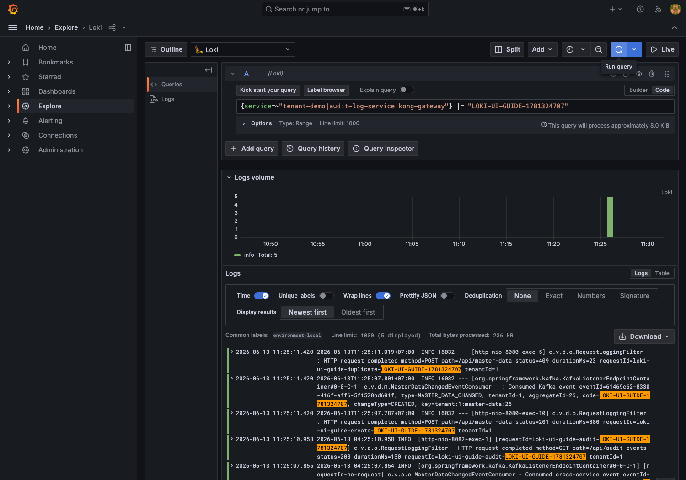

LogQL:

```logql
{service=~"tenant-demo|audit-log-service|kong-gateway"} |= "LOKI-UI-GUIDE"
```

Trong screenshot, code demo là `LOKI-UI-GUIDE-1781324707`. Đây thường là cách dễ nhất để trace business flow đi qua Kafka:

- `tenant-demo` create master data;
- `tenant-demo` publish/consume local event log;
- `audit-log-service` consume/store audit event;
- audit API read request.

### Step 8 - Trace by requestId

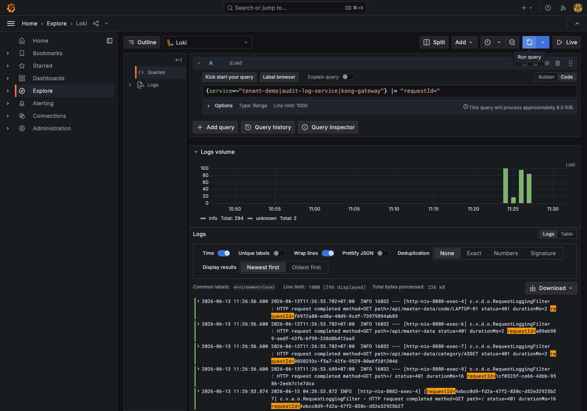

LogQL:

```logql
{service=~"tenant-demo|audit-log-service|kong-gateway"} |= "requestId="
```

`requestId` tốt cho một HTTP request đồng bộ. Với Kafka async boundary, requestId không tự động đi qua service khác trừ khi mình chủ động đưa nó vào event/header/log. Vì vậy với async flow, code hoặc eventId đôi khi dễ trace hơn.

### Step 9 - Debug duplicate conflict `409`

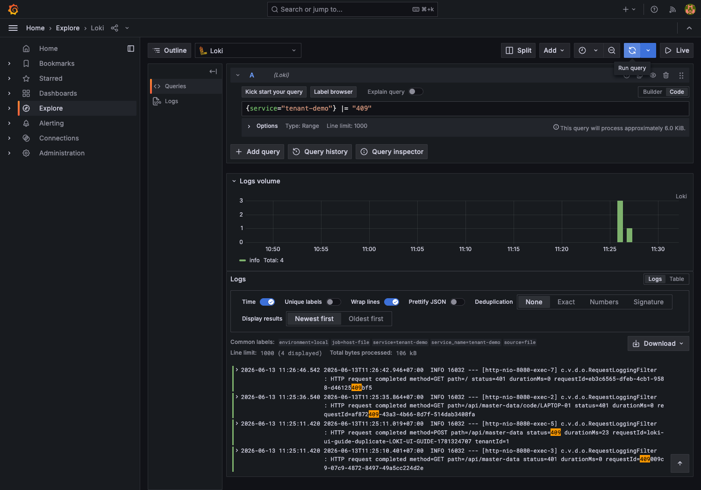

LogQL:

```logql
{service="tenant-demo"} |= "409"
```

Duplicate `master_data.code` trong cùng tenant là business/API conflict. Sau fix, frontend thấy `409 Conflict`, không còn `500 Internal Server Error`.

### Step 10 - Debug authorization failure `403`

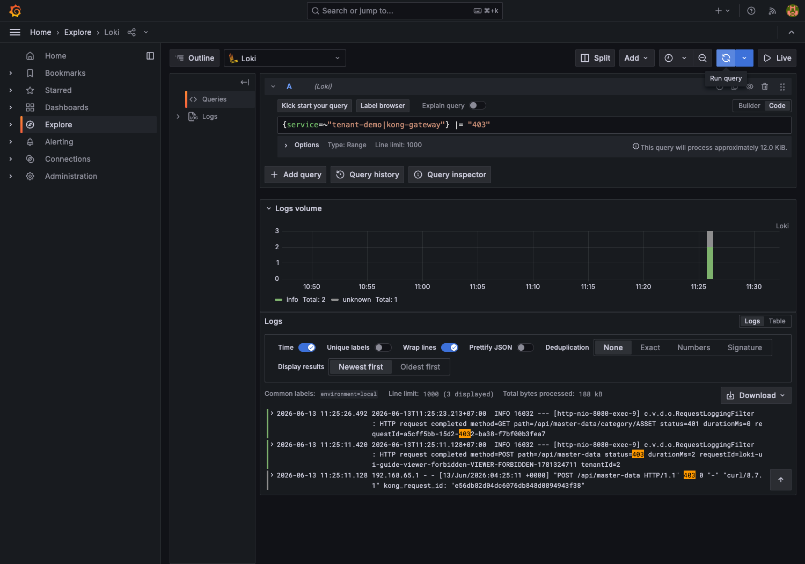

LogQL:

```logql
{service=~"tenant-demo|kong-gateway"} |= "403"
```

`403` nghĩa là user đã authenticated nhưng không đủ authority. Trong demo, `tenant2-user` có role `VIEWER`, nên create master data bị chặn.

### Step 11 - Compare file vs Docker sources

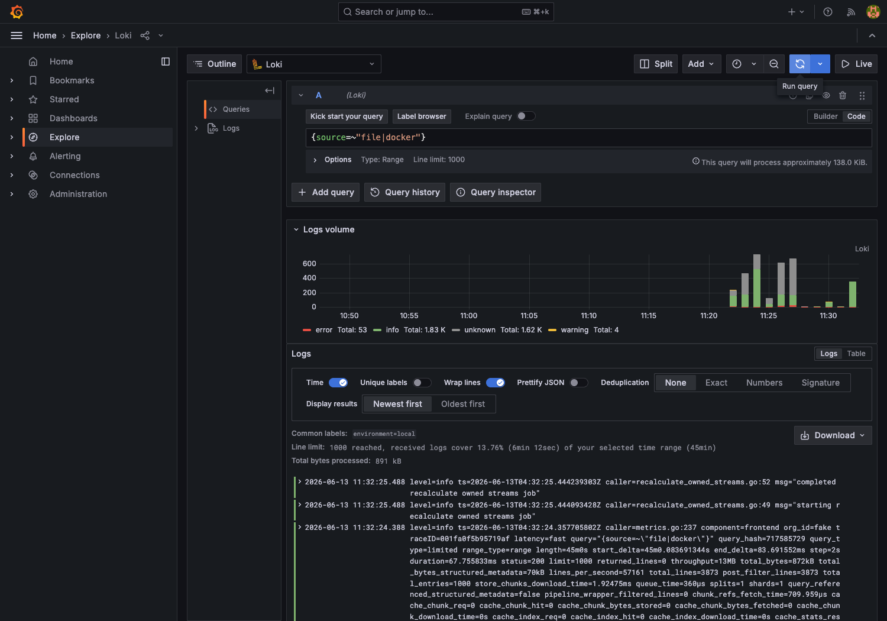

LogQL:

```logql
{source=~"file|docker"}
```

`source="file"` cho host-run `tenant-demo`; `source="docker"` cho Docker services như Kong, audit-log-service, web-ui-demo.

## 5. Step-by-step UI flow

1. Open `http://localhost:13001`.
2. Login with `admin / admin`.
3. Go to `Explore`.
4. Select datasource `Loki`.
5. In Builder mode, open `Label filters`.
6. Choose label `service`.
7. Pick value `tenant-demo`, `audit-log-service`, `kong-gateway`, or `web-ui-demo`.
8. Click `Run query`.
9. Switch to Code mode when you want to add text filters.
10. Add `|= "LOKI-UI-GUIDE"` or `|= "requestId="`.
11. Narrow time range to `Last 5 minutes` or `Last 15 minutes`.

UI helps you discover labels and values. Text filters are usually typed manually after you know which service/layer you want.

## 6. Query recipes

Main system:

```logql
{service=~"tenant-demo|audit-log-service|kong-gateway|web-ui-demo"}
```

Gateway layer:

```logql
{service="kong-gateway"}
```

Business service:

```logql
{service="tenant-demo"}
```

Async consumer:

```logql
{service="audit-log-service"}
```

Frontend container:

```logql
{service="web-ui-demo"}
```

By business code:

```logql
{service=~"tenant-demo|audit-log-service|kong-gateway"} |= "LOKI-UI-GUIDE"
```

By requestId:

```logql
{service=~"tenant-demo|audit-log-service|kong-gateway"} |= "requestId="
```

Duplicate conflict:

```logql
{service="tenant-demo"} |= "409"
```

Forbidden:

```logql
{service=~"tenant-demo|kong-gateway"} |= "403"
```

File source:

```logql
{source="file"}
```

Docker source:

```logql
{source="docker"}
```

## 7. Label strategy

Current useful labels:

- `service`: most important beginner label; start here.
- `source`: explains `file` vs `docker`.
- `environment`: `local` for this lab; useful when later environments exist.
- `container`: useful for Docker debugging, though it can be noisy.
- `filename`: useful for file source, especially `tenant-demo.log`.
- `job`: identifies Alloy pipeline/source grouping.

Intentionally absent as labels:

- `requestId`
- `tenantId`
- `userId`
- token
- business code
- raw path

These values are high-cardinality or sensitive. Keep them in log message and search with `|=`.

## 8. Recommended debugging path

1. Start from `kong-gateway`: did the request reach the gateway, and what status did it return?
2. Check `tenant-demo`: did backend validate JWT, resolve tenant, run DB operation, publish Kafka event?
3. Check `audit-log-service`: did async consumer receive and store the event?
4. Search by business code/eventId for async flow.
5. Search by requestId for one HTTP request.
6. Search `409`, `403`, `500`, `ERROR` for status/error debugging.
7. Keep time range tight: last 5-15 minutes.

## 9. Common mistakes

- Expecting browser console JavaScript errors to appear in Loki. Browser console is separate.
- Searching an old time range and thinking logs are missing.
- Forgetting to run `tenant-demo` with `make app-run-logs`.
- Expecting `requestId` to appear as a label.
- Starting with a too broad query and getting lost.
- Confusing Kafka UI with Loki: Kafka UI shows messages/consumer groups; Loki shows service logs.
- Confusing metrics Grafana and logs Grafana: Prometheus/Grafana metrics answer numeric trends; Loki/Grafana logs answer what happened.
