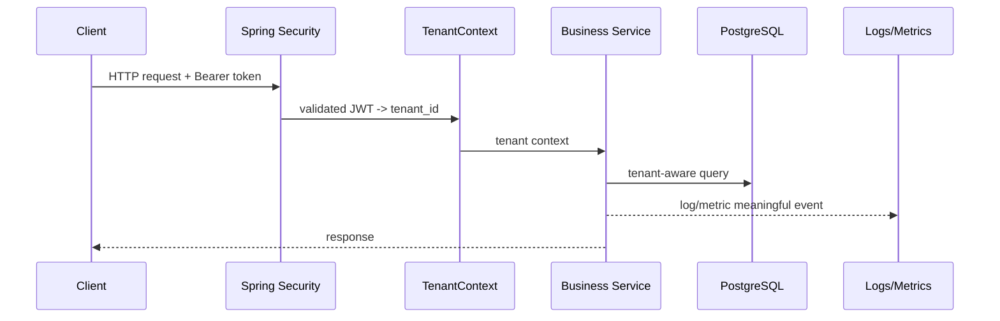

# Logging, metrics, tracing - shape và cách đọc

## Vai trò tài liệu

Tài liệu này đi sâu vào “dữ liệu observability trông như thế nào”. Mục tiêu là đọc log/metric/trace có phương pháp trước khi tự thêm Actuator hoặc custom metrics vào `tenant-demo`.

---

## 1. Logging

Log là bản ghi sự kiện đã xảy ra. Log tốt giúp trả lời: “request/event này đã đi qua bước nào và lỗi ở đâu?”.

### Log nên có gì?

Một log backend hữu ích thường có:

- timestamp.
- level: `INFO`, `WARN`, `ERROR`.
- message ngắn, rõ.
- request id/correlation id nếu có.
- tenantId nếu đã lấy từ token/context hợp lệ.
- business id an toàn: `masterDataId`, `eventId`.
- technical context: topic, partition, offset, endpoint, status.

Ví dụ hiện có trong Kafka mini-lab:

```text
Published Kafka event eventId=..., tenantId=1, aggregateId=10,
changeType=UPDATED, topic=master-data-events, key=tenant:1:master-data:10,
partition=0, offset=42
```

Log này tốt cho học tập vì biết producer đã gửi event nào, vào topic nào, partition/offset nào.

### Không log gì?

- JWT/access token.
- password/secret.
- raw file content.
- raw Authorization header.
- full payload chứa dữ liệu nhạy cảm.
- object storage presigned URL nếu sau này có.

---

## 2. Metrics

Metric là số đo dạng time series. Metrics phù hợp để trả lời câu hỏi tổng hợp:

- Có bao nhiêu request?
- Bao nhiêu lỗi?
- Latency p95 là bao nhiêu?
- Cache hit/miss ra sao?
- Kafka publish fail bao nhiêu lần?

Metric thường có:

```text
name + tags/labels + value
```

Ví dụ conceptual:

```text
tenant_demo.kafka.publish.total{topic="master-data-events",result="success"} 15
tenant_demo.cache.master_data.lookup.total{result="hit"} 120
tenant_demo.cache.master_data.lookup.total{result="miss"} 30
```

### Tag/label cần cẩn thận

Nên dùng tag có số lượng giá trị hữu hạn:

- `result=success|failure`
- `method=GET|POST`
- `status=200|401|403|404|500`
- `topic=master-data-events`

Cẩn thận với tag có cardinality cao:

- `userId`
- `tenantId` nếu có rất nhiều tenant.
- `fileId`
- `eventId`
- raw URL có id động.

Trong Phase 1 có thể dùng tenantId để học/debug local, nhưng production cần cân nhắc cardinality và privacy.

---

## 3. Tracing

Trace mô tả hành trình của một request qua nhiều bước/service. Một trace thường gồm nhiều span:

```text
HTTP request span
-> DB query span
-> Kafka publish span
-> downstream service span
```

Trong repo hiện tại mới có một service nên tracing chưa cần làm sâu. Chỉ cần hiểu sau này khi có API Gateway + nhiều backend services, trace giúp biết request chậm ở service nào.

---

## 4. Health check

Health check trả lời câu hỏi kỹ thuật: “service/dependency có sẵn sàng không?”.

Ví dụ Actuator:

- `/actuator/health`: service health.
- `/actuator/info`: thông tin app nếu cấu hình.
- `/actuator/metrics`: danh sách/chi tiết metrics.

Health check không trả lời được:

- Tenant isolation có đúng không?
- User có quyền đúng không?
- Kafka event có idempotent không?
- Search result có stale không?

Những câu hỏi đó cần test, verification script hoặc business validation.

---

## 5. Alert

Alert là rule báo động khi metric/log pattern vượt ngưỡng. Ví dụ:

- error rate > 5% trong 5 phút.
- p95 latency > 1s.
- Kafka publish failure tăng liên tục.
- DB health down.

Phase 1 chưa cần alert thật. Chỉ cần biết metric nên hỗ trợ quyết định vận hành sau này.

---

## 6. Request flow quan sát được



Observability nên bám vào flow này, nhưng không được thay thế auth, tenant-aware query hoặc tests.

---

## 7. Common mistakes

- Dùng log như database audit chính thức.
- Thêm metric với label quá chi tiết làm cardinality nổ.
- Log toàn bộ payload để “debug cho dễ”.
- Expose actuator endpoint nhạy cảm public.
- Dựa vào health check thay cho integration test.
- Không phân biệt technical health và business correctness.

---

## 8. Cách áp dụng vào mini-lab

Khi tự code mini-lab sau:

1. Bật Actuator cơ bản.
2. Verify `/actuator/health`.
3. Verify `/actuator/info` nếu có app info.
4. Verify `/actuator/metrics`.
5. Chọn 1 điểm business/infrastructure để instrument nhẹ:
   - cache hit/miss; hoặc
   - Kafka publish success/failure; hoặc
   - file upload/download count.
6. Ghi rõ caveat: đây là local learning, chưa có dashboard/alert/tracing production.

---

## Nguồn tham khảo chuẩn

- [Spring Boot Actuator endpoints](https://docs.spring.io/spring-boot/reference/actuator/endpoints.html)
- [Spring Boot Actuator metrics](https://docs.spring.io/spring-boot/reference/actuator/metrics.html)
- [Micrometer Observation](https://docs.micrometer.io/micrometer/reference/observation.html)
