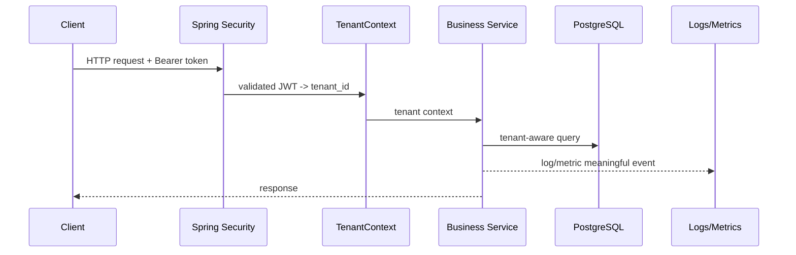

# Logging, metrics, tracing - shape và cách đọc

## Vai trò tài liệu

Tài liệu này đi sâu vào “dữ liệu observability trông như thế nào”. Mục tiêu là đọc log/metric/trace có phương pháp trước khi tự thêm Actuator hoặc custom metrics vào `tenant-demo`.

---

## 1. Logging

Log là bản ghi sự kiện đã xảy ra. Log tốt giúp trả lời: “request/event này đã đi qua bước nào và lỗi ở đâu?”.

Điểm dễ nhầm: log không phải endpoint để mình gọi như `/actuator/metrics`. App chủ động emit log ra console/stdout/file hoặc hệ thống thu log bên ngoài. Trong Phase 1, mình đọc log trực tiếp ở terminal hoặc file log. Từ Phase 1.5, local lab có thêm Loki + Grafana Alloy để gom container/file logs và search tập trung qua Grafana Explore (`lab-code/loki-lab/`).

### Log nên có gì?

Một log backend hữu ích thường có:

- timestamp.
- level: `INFO`, `WARN`, `ERROR`.
- message ngắn, rõ.
- request id/correlation id nếu có.
- tenantId nếu đã lấy từ token/context hợp lệ.
- business id an toàn: `masterDataId`, `eventId`.
- technical context: topic, partition, offset, endpoint, status.

Ví dụ request log baseline trong repo:

```text
HTTP request completed method=GET path=/api/master-data status=200 durationMs=18 requestId=demo-request-001 tenantId=1
```

Ý nghĩa:

- `method/path/status`: request nào đã chạy và trả status gì.
- `durationMs`: request mất bao lâu ở mức gần đúng.
- `requestId`: nối các log thuộc cùng một request.
- `tenantId`: chỉ log khi đã có từ JWT đã validate/TenantContext flow; không lấy từ request body/query.

Ví dụ hiện có trong Kafka mini-lab:

```text
Published Kafka event eventId=..., tenantId=1, aggregateId=10,
changeType=UPDATED, topic=master-data-events, key=tenant:1:master-data:10,
partition=0, offset=42
```

Log này tốt cho học tập vì biết producer đã gửi event nào, vào topic nào, partition/offset nào.

### Không log gì?

- JWT/access token.
- password/secret.
- raw file content.
- raw Authorization header.
- full payload chứa dữ liệu nhạy cảm.
- object storage presigned URL nếu sau này có.

### Request id / correlation id

`requestId` là định danh kỹ thuật cho một request. Client có thể gửi header `X-Request-Id`; nếu không gửi, app tự sinh UUID.

Request id không thay thế authentication hoặc authorization. Nó chỉ giúp debug:

```text
requestId=abc -> request vào controller
requestId=abc -> service gọi database
requestId=abc -> response trả 200
```

Khi có nhiều service, khái niệm này thường mở rộng thành correlation id/trace id.

### MDC là gì?

MDC (Mapped Diagnostic Context) là context logging theo thread. Trong `tenant-demo`, `RequestLoggingFilter` put `requestId` vào MDC để pattern log có thể in ra:

```text
[requestId=demo-request-001]
```

Vì MDC gắn với thread, cần nhớ caveat:

- HTTP request đồng bộ: MDC thường hoạt động dễ hiểu.
- Async/Kafka/thread khác: MDC không tự đi theo message/thread/process. Nếu cần correlation id qua Kafka, phải đưa id vào event/header và set lại ở consumer.
- Luôn clear MDC sau request để tránh thread pool reuse làm lẫn request id.

---

## 2. Metrics

Metric là số đo dạng time series. Metrics phù hợp để trả lời câu hỏi tổng hợp:

- Có bao nhiêu request?
- Bao nhiêu lỗi?
- Latency p95 là bao nhiêu?
- Cache hit/miss ra sao?
- Kafka publish fail bao nhiêu lần?

Metric thường có:

```text
name + tags/labels + value
```

Ví dụ conceptual:

```text
tenant_demo.kafka.publish.total{topic="master-data-events",result="success"} 15
tenant_demo.cache.master_data.lookup.total{result="hit"} 120
tenant_demo.cache.master_data.lookup.total{result="miss"} 30
```

### Tag/label cần cẩn thận

Nên dùng tag có số lượng giá trị hữu hạn:

- `result=success|failure`
- `method=GET|POST`
- `status=200|401|403|404|500`
- `topic=master-data-events`

Cẩn thận với tag có cardinality cao:

- `userId`
- `tenantId` nếu có rất nhiều tenant.
- `fileId`
- `eventId`
- raw URL có id động.

Trong Phase 1 có thể dùng tenantId để học/debug local, nhưng production cần cân nhắc cardinality và privacy.

### Built-in metrics vs custom metrics

Actuator/Micrometer có metric built-in như JVM memory, HTTP server requests, datasource pool. Custom metrics là metric do code app tự ghi thêm khi có câu hỏi vận hành rõ.

Trong `tenant-demo`, custom metrics baseline hiện nằm ở:

- Redis cache-aside: hit/miss/put/error.
- Kafka publish: success/failure/duration.
- `MasterDataService.getByCode`: duration theo cache enabled/disabled và result.

Metric ví dụ:

```text
tenant_demo.master_data.cache.requests{result="hit"}
tenant_demo.kafka.publish.requests{event="master_data_changed",result="success"}
tenant_demo.master_data.get_by_code.duration{cache="enabled",result="found"}
```

Đọc thêm: `micrometer-custom-metrics.md`.

### `/actuator/metrics`, Prometheus và Grafana

Trong Spring Boot lab hiện tại có hai cách đọc metric:

- `/actuator/metrics`: JSON endpoint của Actuator, phù hợp để inspect nhanh metric names/measurements trong lúc học; repo yêu cầu Bearer token.
- `/actuator/prometheus`: text endpoint theo Prometheus exposition format; local Prometheus scrape endpoint này theo chu kỳ.

Grafana không đọc trực tiếp business API và cũng không nhận metric do app push lên. Flow đúng trong local lab là:

```text
tenant-demo -> /actuator/prometheus -> Prometheus scrape/store -> Grafana query Prometheus
```

Tên metric có thể đổi shape khi qua Prometheus. Ví dụ `tenant_demo.kafka.publish.requests` thành `tenant_demo_kafka_publish_requests_total`.

Đọc thêm: `prometheus-grafana-local-lab.md`.

---

## 3. Tracing

Trace mô tả hành trình của một request qua nhiều bước/service. Một trace thường gồm nhiều span:

```text
HTTP request span
-> DB query span
-> Kafka publish span
-> downstream service span
```

Trong repo hiện tại mới có một service nên tracing chưa cần làm sâu. Chỉ cần hiểu sau này khi có API Gateway + nhiều backend services, trace giúp biết request chậm ở service nào.

---

## 4. Health check

Health check trả lời câu hỏi kỹ thuật: “service/dependency có sẵn sàng không?”.

Ví dụ Actuator:

- `/actuator/health`: service health.
- `/actuator/info`: thông tin app nếu cấu hình.
- `/actuator/metrics`: danh sách/chi tiết metrics.

Health check không trả lời được:

- Tenant isolation có đúng không?
- User có quyền đúng không?
- Kafka event có idempotent không?
- Search result có stale không?

Những câu hỏi đó cần test, verification script hoặc business validation.

---

## 5. Alert

Alert là rule báo động khi metric/log pattern vượt ngưỡng. Ví dụ:

- error rate > 5% trong 5 phút.
- p95 latency > 1s.
- Kafka publish failure tăng liên tục.
- DB health down.

Phase 1 chưa cần alert thật. Chỉ cần biết metric nên hỗ trợ quyết định vận hành sau này.

---

## 6. Request flow quan sát được



Observability nên bám vào flow này, nhưng không được thay thế auth, tenant-aware query hoặc tests.

---

## 7. Common mistakes

- Dùng log như database audit chính thức.
- Thêm metric với label quá chi tiết làm cardinality nổ.
- Log toàn bộ payload để “debug cho dễ”.
- Expose actuator endpoint nhạy cảm public.
- Dựa vào health check thay cho integration test.
- Không phân biệt technical health và business correctness.

---

## 8. Cách áp dụng vào mini-lab

Trong mini-lab hiện tại:

1. Actuator baseline đã bật `health`, `info`, `metrics`, `prometheus`.
2. `RequestLoggingFilter` log một dòng ngắn sau mỗi request, skip `/actuator/health` để tránh ồn.
3. Log pattern console có `requestId` từ MDC.
4. Request thiếu token vẫn được log với status `401`; request hợp lệ có thể log thêm `tenantId` sau khi token được validate.
5. `ApplicationMetrics` ghi custom Counter/Timer nhỏ cho Redis/Kafka/master_data getByCode.
6. `/actuator/prometheus` expose built-in/custom metrics ở format Prometheus.
7. `lab-code/observability-lab/` chạy Prometheus + Grafana local để thấy scrape target và dashboard nhỏ.
8. Dùng `lab-code/tenant-demo/http/observability-api.http` để verify request log, Actuator metrics và Prometheus endpoint.
9. Ghi rõ caveat: đây là local learning, chưa có alert/tracing production. Log aggregation local đã có qua Loki/Alloy từ Phase 1.5.

---

## Nguồn tham khảo chuẩn

- [Spring Boot Actuator endpoints](https://docs.spring.io/spring-boot/reference/actuator/endpoints.html)
- [Spring Boot Actuator metrics](https://docs.spring.io/spring-boot/reference/actuator/metrics.html)
- [Micrometer Observation](https://docs.micrometer.io/micrometer/reference/observation.html)
