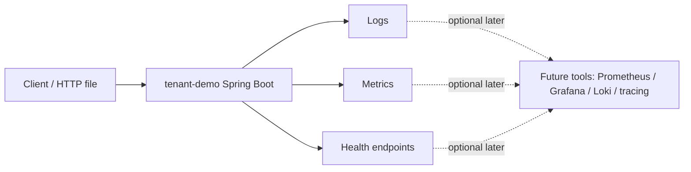

# Observability foundation cho backend service

## Vai trò tài liệu

Tài liệu này giải thích nền tảng observability để đọc và thiết kế bước mini-lab tiếp theo cho `tenant-demo`. Đây không phải hướng dẫn dựng full Prometheus/Grafana/Loki production.

Mục tiêu Phase 1:

- Hiểu observability là gì và vì sao backend cần nó.
- Phân biệt logging, metrics, tracing, health check và alert.
- Biết signal nào có ích cho API multi-tenant hiện tại.
- Tránh log secret/token/dữ liệu nhạy cảm.
- Chuẩn bị để tự code Spring Boot Actuator + logging/metrics nhỏ ở bước sau.

---

## 1. Observability là gì?

Observability là khả năng nhìn vào hệ thống đang chạy để trả lời các câu hỏi như:

- Service còn sống không?
- Request lỗi vì database, auth, cache, Kafka hay logic nghiệp vụ?
- Endpoint nào chậm?
- Lỗi tăng từ khi nào?
- Tenant nào đang tạo tải lớn bất thường?
- Kafka publish có fail không?
- Cache có thật sự hit không?

Một backend chạy được chưa chắc đã vận hành được. Observability giúp biết chuyện gì đang xảy ra khi service không còn chạy trong IDE của mình nữa.

---

## 2. Các loại signal chính

| Signal | Trả lời câu hỏi | Ví dụ trong repo |
|---|---|---|
| Log | Chuyện gì vừa xảy ra? | `Published Kafka event`, `Consumed Kafka event`, cache hit/miss. |
| Metric | Bao nhiêu lần, nhanh/chậm thế nào? | request count, error count, latency, cache hit ratio. |
| Trace | Một request đi qua những service/bước nào? | Request -> API Gateway -> service A -> service B, awareness sau. |
| Health check | Service/dependency có sẵn sàng không? | `/actuator/health` kiểm tra app hoặc DB ở mức kỹ thuật. |
| Alert | Khi nào cần con người xử lý? | error rate cao, Kafka publish fail liên tục, DB down. |

### Vì sao log thôi chưa đủ?

Log giúp đọc từng sự kiện cụ thể, nhưng khó trả lời câu hỏi tổng hợp:

- Trong 5 phút qua có bao nhiêu request lỗi?
- P95 latency của `/api/master-data/code/{code}` là bao nhiêu?
- Cache hit rate có tăng sau khi bật Redis không?
- Kafka publish fail bao nhiêu lần?

Metrics phù hợp cho số liệu tổng hợp. Tracing phù hợp khi một request đi qua nhiều service. Health check phù hợp để kiểm tra service sống/chết, nhưng không chứng minh business đúng.

---

## 3. Mental model đơn giản

Trong Phase 1, ưu tiên:

- Actuator health/info/metrics ở mức local.
- Log có cấu trúc vừa đủ để debug.
- Một vài metrics có ý nghĩa nếu cần.
- Chưa dựng dashboard lớn.

---

## 4. Áp dụng vào `tenant-demo`

`tenant-demo` hiện có nhiều thành phần backend đáng quan sát:

| Thành phần | Điều nên quan sát |
|---|---|
| HTTP API | request count, status code, latency. |
| Spring Security / Keycloak | 401 vs 403, không log token. |
| TenantContext | tenantId giúp debug scope, nhưng không log dữ liệu nhạy cảm. |
| PostgreSQL/Flyway | DB health, migration/startup error. |
| Redis cache | hit/miss, TTL/stale caveat. |
| Kafka | publish success/failure, consumed event count. |
| Elasticsearch | search request count, failure count. |
| MinIO | upload/download count, object access error. |

Điểm cốt lõi: observability không thay correctness test. `DataLeakageTest` vẫn là guard chống leakage; log/metric chỉ giúp phát hiện và debug vận hành.

---

## 5. Multi-tenant logging rule

Nên log:

- `tenantId` ở mức context khi cần debug tenant scope.
- `requestId`/correlation id nếu sau này thêm.
- status code, endpoint, duration.
- eventId, aggregateId, changeType cho Kafka.
- cache key pattern nếu đã ẩn dữ liệu nhạy cảm.

Không nên log:

- access token/JWT.
- password/secret/API key.
- raw Authorization header.
- full request body nếu có dữ liệu kế toán/chứng từ.
- file content hoặc presigned URL dài.
- dữ liệu tenant khác chỉ để debug.

TenantId hữu ích để debug, nhưng vẫn là dữ liệu định danh nội bộ. Khi làm production, cần policy rõ hơn về log retention và ai được đọc log.

---

## 6. Metrics hữu ích cho repo này

Nên bắt đầu ít nhưng có ý nghĩa:

- HTTP request count theo endpoint/status.
- HTTP latency theo endpoint.
- error count.
- Redis cache hit/miss cho `master_data`.
- Kafka publish success/failure.
- MinIO upload/download count.
- Elasticsearch search success/failure.

Không nên thêm metric chỉ vì “có thể thêm”. Mỗi metric nên trả lời được một câu hỏi vận hành hoặc debugging.

---

## 7. Common mistakes

- Log quá nhiều làm khó đọc và có thể lộ dữ liệu.
- Log token/secret/password.
- Nghĩ `/actuator/health` pass nghĩa là business đúng.
- Gắn logic metrics vào business code quá sâu.
- Tạo metric nhưng không biết dùng để quyết định gì.
- Dùng tenantId từ request chưa validate để log/metric.
- Expose `/actuator/env`, `/actuator/beans`, `/actuator/configprops` bừa bãi.

---

## 8. Phase 1 scope

Nên làm trong mini-lab:

- Thêm Spring Boot Actuator.
- Expose `health`, `info`, `metrics` local một cách an toàn.
- Thêm request logging nhỏ hoặc học cách đọc log hiện có.
- Thêm 1-2 counter/timer nếu cần, ví dụ Kafka publish success/failure hoặc cache hit/miss.

Chưa cần làm ngay (ghi chú Phase 1 ban đầu):

- Prometheus/Grafana stack đầy đủ.
- Loki/ELK log pipeline. *(Ghi chú Phase 1.5: Loki + Alloy local lab đã được bổ sung sau trong `lab-code/loki-lab/`.)*
- Distributed tracing với OpenTelemetry.
- Alerting production.
- Log aggregation multi-service production.

---

## Nguồn tham khảo chuẩn

- [Spring Boot Actuator endpoints](https://docs.spring.io/spring-boot/reference/actuator/endpoints.html)
- [Spring Boot Actuator metrics](https://docs.spring.io/spring-boot/reference/actuator/metrics.html)
- [Micrometer documentation](https://docs.micrometer.io/micrometer/reference/index.html)
- [Micrometer Observation](https://docs.micrometer.io/micrometer/reference/observation.html)
