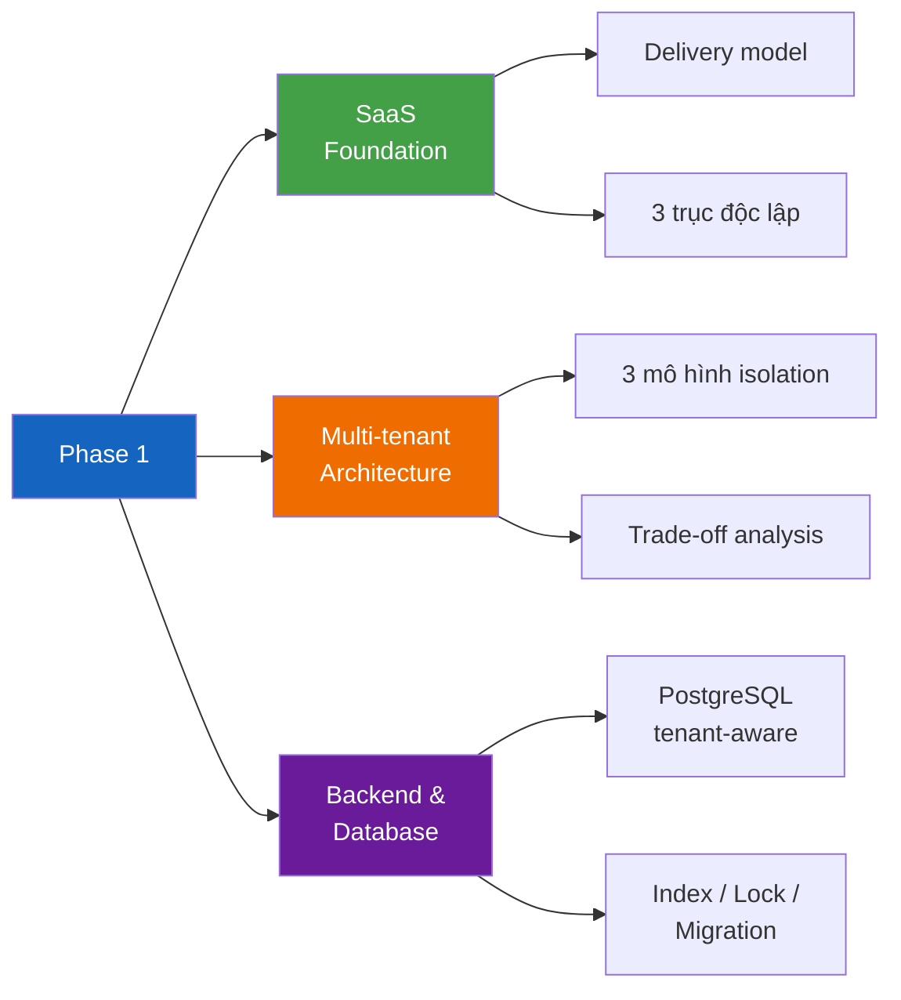
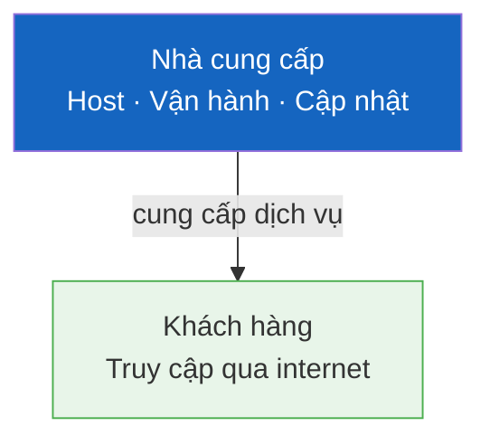
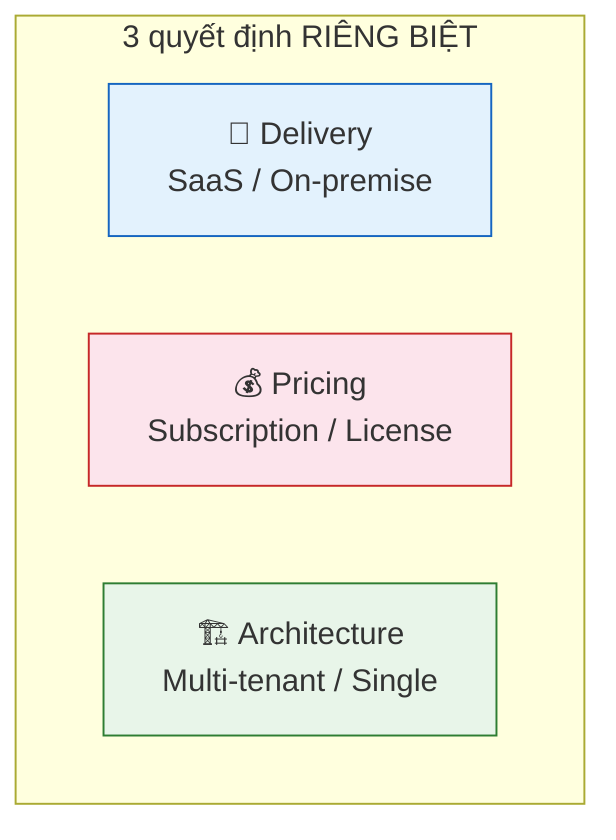
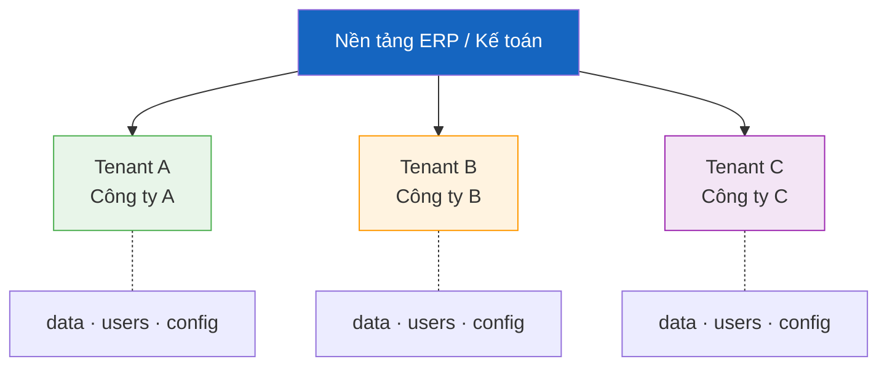
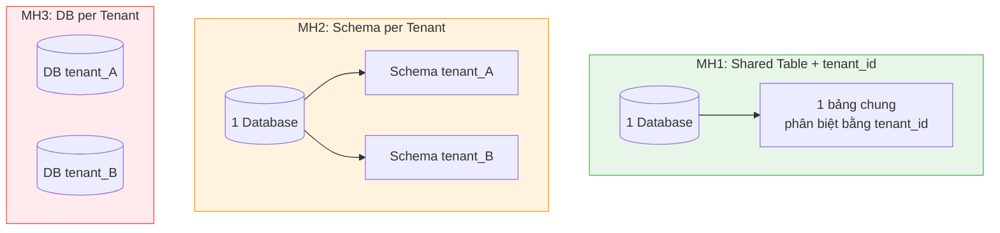
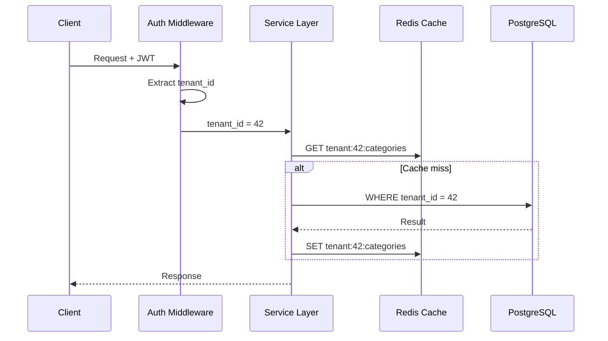
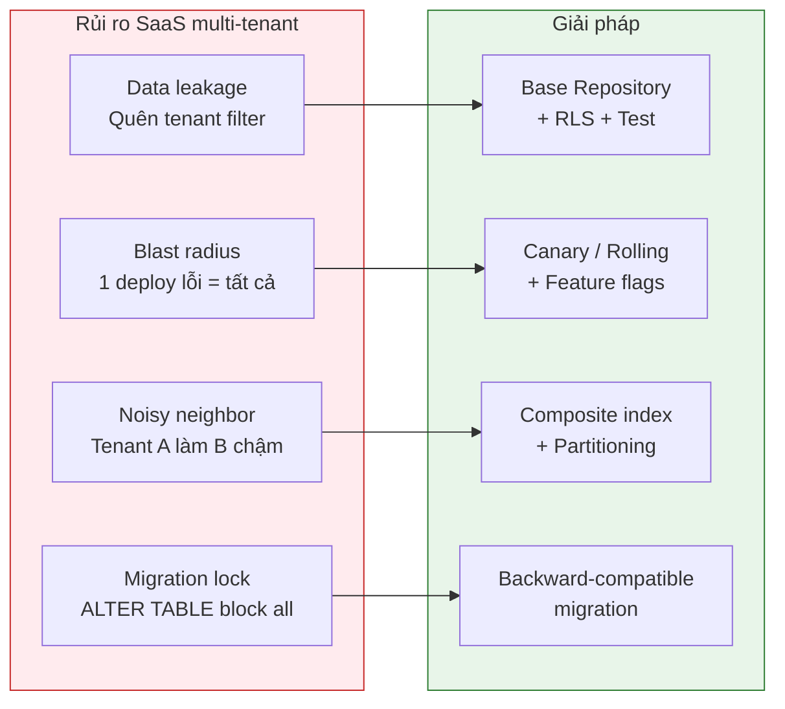
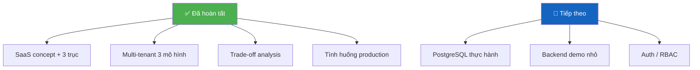

# Thuyết trình: SaaS, Multi-tenant & Nền tảng Backend

> **Mục đích:** Tài liệu Visual Anchor — mở lên khi báo cáo trực tiếp với leader.
> Mỗi phần = 1 "slide". Nhìn sơ đồ → đọc bullet → tự nói mở rộng.

---

## Slide 1 — Em đã học gì trong Phase 1?

**Core facts:**
- Gần hoàn tất nền tảng SaaS + multi-tenant.
- Đang đi sâu vào database/backend.
- Repo = kho kiến thức, chưa có code demo.

> **Speaker script:** "Em đã dành thời gian tập trung vào 3 mảng: hiểu SaaS là gì ở mức delivery model, hiểu multi-tenant là kiến trúc phục vụ nhiều khách hàng, và bắt đầu tìm hiểu database backend liên quan trực tiếp. Em xin trình bày qua từng phần."

---

## Slide 2 — SaaS là gì?

**Core facts:**
- SaaS = mô hình **phân phối phần mềm** (delivery model).
- Nhà cung cấp chịu trách nhiệm vận hành, khách hàng dùng như dịch vụ.
- SaaS ≠ Cloud. SaaS ≠ Subscription. SaaS ≠ Multi-tenant.

> **Speaker script:** "SaaS không phải là 'chạy trên cloud'. Nó là câu chuyện AI host và vận hành phần mềm. Cloud là hạ tầng, subscription là cách tính tiền, multi-tenant là cách phục vụ nhiều khách — ba thứ khác nhau."

---

## Slide 3 — 3 trục độc lập

**Core facts:**
- 3 trục này **thường đi cùng** nhưng **không bắt buộc**.
- JetBrains = on-premise + subscription.
- SaaS single-tenant tồn tại. Multi-tenant on-premise cũng tồn tại.

> **Speaker script:** "Đây là điểm em đã sửa lại trong quá trình học. Ban đầu em hay gộp SaaS với multi-tenant. Thực tế đây là ba quyết định riêng. Dự án mình chọn cả 3: SaaS delivery, subscription pricing, multi-tenant architecture."

---

## Slide 4 — Multi-tenant là gì?

**Core facts:**
- Nhiều doanh nghiệp dùng **chung nền tảng**, nhưng dữ liệu **phải cách ly**.
- Chia sẻ: code, hạ tầng, deploy pipeline.
- Cách ly: data, quyền, cache, log, config.
- Rủi ro lớn nhất = **data leakage**.

> **Speaker script:** "Mỗi doanh nghiệp trong bài toán kế toán là một tenant. Họ dùng chung hệ thống nhưng dữ liệu kế toán phải hoàn toàn tách biệt. Nếu để lộ dữ liệu — đó là lỗi bảo mật nghiêm trọng."

---

## Slide 5 — 3 mô hình Tenant Isolation

| | MH1 Shared table | MH2 Schema/tenant | MH3 DB/tenant |
|---|:---:|:---:|:---:|
| **Chi phí** | 💰 | 💰💰 | 💰💰💰 |
| **Isolation** | Thấp | Trung bình | Cao |
| **Migration** | 1 lần | N lần | N lần (độc lập) |
| **Phase 1** | ✅ Chọn | Chưa cần | Quá phức tạp |

> **Speaker script:** "Phase 1 chọn MH1 — shared table với tenant_id. Đơn giản nhất, học được đúng vấn đề. Nếu sau này có khách enterprise yêu cầu isolation mạnh, có thể chuyển sang hybrid: SME dùng MH1, enterprise dùng MH3."

---

## Slide 6 — Tenant-aware: mọi tầng phải biết tenant

**Core facts:**
- Auth → Service → Cache → DB: tất cả phải biết tenant.
- Cache key thiếu tenant prefix = data leakage qua cache.
- Query thiếu `WHERE tenant_id` = data leakage qua DB.

> **Speaker script:** "Không chỉ database. Cache, log, auth, metrics — tất cả phải tenant-aware. Em đã phân tích cụ thể các tình huống lỗi như cache key thiếu prefix, query thiếu filter, và cách phòng tránh."

---

## Slide 7 — Các tình huống thực tế đã phân tích

> **Speaker script:** "Em đã phân tích 4 tình huống rủi ro chính. Mỗi cái có giải pháp cụ thể. Ví dụ data leakage — phòng bằng Base Repository auto-filter, PostgreSQL RLS, và integration test. Blast radius — giảm bằng canary deployment và feature flags."

---

## Slide 8 — Kết luận và hướng tiếp

**Core facts:**
- Nền tảng SaaS + multi-tenant: **gần hoàn tất**.
- Đã phát triển tư duy **trade-off**, không chỉ liệt kê đặc điểm.
- Tiếp theo: PostgreSQL thực hành, code demo, Auth/RBAC.

> **Speaker script:** "Tóm lại, em đã nắm được nền tảng SaaS và multi-tenant. Bước tiến lớn nhất là chuyển từ 'biết là gì' sang 'hiểu trade-off'. Tiếp theo em sẽ bắt đầu thực hành code demo để kiểm chứng kiến thức, bắt đầu từ shared table + tenant_id trên PostgreSQL."

---

> **Ghi chú khi leader hỏi ngoài lề:**
>
> - *"Tại sao không dùng MongoDB?"* → Kế toán cần ACID mạnh, foreign key constraint, dữ liệu quan hệ chặt. MongoDB eventual consistency không phù hợp cho nghiệp vụ tài chính chính thống.
> - *"Schema per tenant có phức tạp lắm không?"* → 500 tenant = 500 schema. Migration phải loop qua tất cả. 1 schema fail = partial migration = inconsistency.
> - *"Noisy neighbor giải quyết thế nào?"* → Composite index `(tenant_id, ...)`, table partitioning, connection pool isolation, read replica cho report nặng.
> - *"Feature flag hoạt động thế nào?"* → 2 bảng: `feature_flags` + `tenant_feature_flags`. Check ở service layer, cache per tenant.
